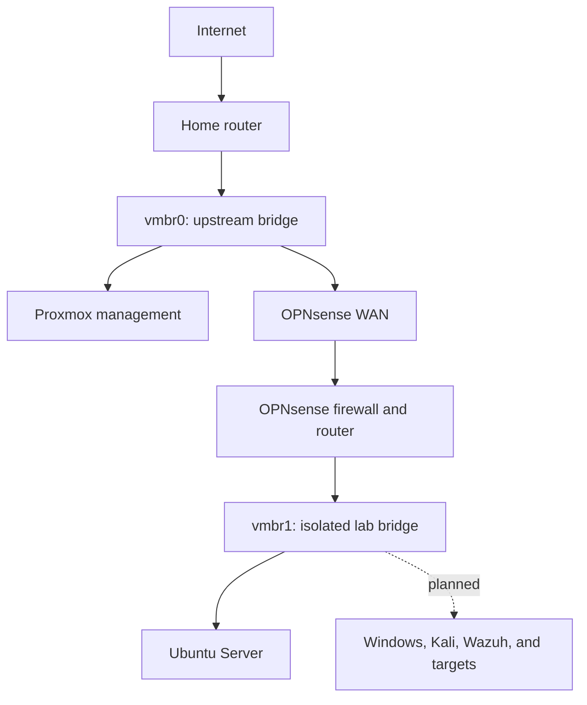
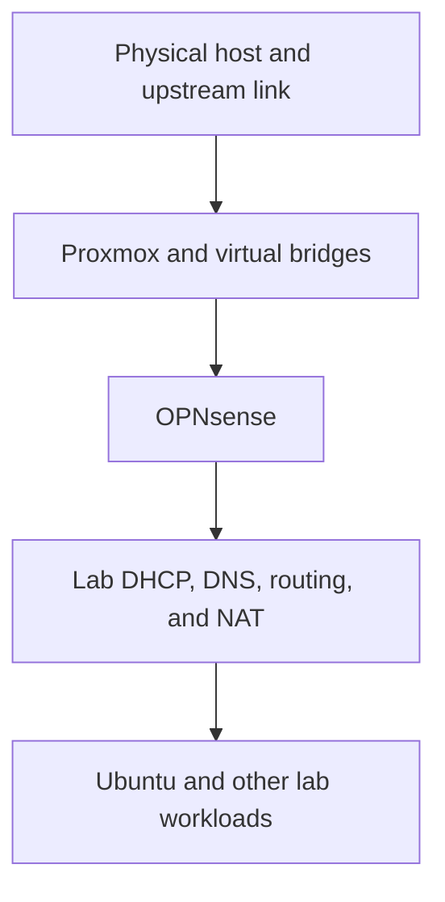

# Lab Architecture

> **Document status:** Living document  
> **Last updated:** 2026-09-02  
> **Lab phase:** Proxmox foundation, IPv4 network segmentation, and Ubuntu Server baseline  
> **Publication status:** Sanitized for a public portfolio

## 1. Purpose

This document describes the physical platform, virtualization layer, storage layout, virtual networks, system roles, dependencies, resource plan, and intended evolution of the Proxmox cybersecurity home lab.

The architecture is designed to support practical work in virtualization, network security, Linux and Windows administration, identity management, vulnerability testing, security monitoring, and recovery testing without requiring every planned system to run simultaneously.

Detailed trust rules, traffic restrictions, validation requirements, and residual risks are maintained separately in [security-boundaries.md](security-boundaries.md).

## 2. Design Goals

The lab architecture follows six goals:

1. **Isolation:** Laboratory systems use an internal virtual network rather than connecting directly to the home network.
2. **Controlled connectivity:** OPNsense is the intended routed path between the lab and upstream networks.
3. **Resource efficiency:** Workloads are started in task-specific groups that fit within the host's 32 GB of RAM.
4. **Realistic administration:** Core systems use full virtual machines when an independent operating-system kernel or stronger isolation is valuable.
5. **Recoverability:** Snapshots and later independent backups support controlled changes and restoration exercises.
6. **Documented growth:** Current systems and future systems are clearly distinguished so the repository does not claim unfinished work as operational.

## 3. Current Architecture Summary

| Layer | Current implementation | Status |
|---|---|---|
| Physical host | Dedicated Dell OptiPlex 7090 SFF | **Operational** |
| Hypervisor | Proxmox VE on node `pve` | **Operational** |
| Upstream bridge | `vmbr0`, connected to the physical Ethernet interface | **Operational** |
| Isolated bridge | `vmbr1`, with no physical uplink | **Operational** |
| Network boundary | Two-interface OPNsense virtual machine | **Operational for IPv4** |
| First endpoint | Ubuntu Server virtual machine on `vmbr1` | **Baseline in progress** |
| Windows, Kali, and Wazuh systems | Defined in the roadmap but not yet deployed | **Planned** |
| Independent backup and restore architecture | Not yet implemented or tested | **Planned** |

The home router remains the household internet-edge router. OPNsense operates behind it and creates a second, lab-specific network boundary.

## 4. Physical Platform

| Resource | Current platform | Architectural purpose |
|---|---|---|
| Host | Dell OptiPlex 7090 SFF | Dedicated hardware for the cybersecurity lab |
| Processor | Intel Core i7 | Provides hardware virtualization and sufficient CPU capacity for several concurrent lab workloads |
| Memory | 32 GB RAM | Shared by Proxmox, OPNsense, and whichever lab systems are needed for the current exercise |
| Primary storage | Local solid-state storage managed by Proxmox | Stores the hypervisor, installation media, and virtual disks |
| Networking | One active physical Ethernet connection | Connects `vmbr0` to the upstream private network |
| Display and input | Used primarily for local recovery and initial installation | Routine administration occurs remotely from a trusted workstation |

Exact serial numbers, MAC addresses, upstream addresses, and storage-device identifiers are intentionally excluded from the public repository.

## 5. Proxmox and Storage Architecture

Proxmox VE is the bare-metal hypervisor. It creates and schedules the virtual CPU, memory, disk, and network devices presented to each guest operating system.

### Proxmox node

| Setting | Value | Meaning |
|---|---|---|
| Node name | `pve` | Identifies the current physical Proxmox host |
| Node count | One | The lab is not a Proxmox cluster and does not provide high availability |
| Management path | Trusted upstream private network through `vmbr0` | Allows web-based and administrative access without placing management directly on the lab bridge |

### Storage roles

| Proxmox storage | Primary use | Notes |
|---|---|---|
| `local` | ISO images, container templates, and selected host files | Installation media is stored separately from guest virtual disks |
| `local-lvm` | VM and LXC virtual disks | LVM-thin supports efficient block storage and thin provisioning |

Thin provisioning means the maximum size assigned to a virtual disk is not necessarily consumed immediately. Physical storage usage increases as the guest writes data. Thin provisioning improves flexibility, but free space still requires monitoring because allocated virtual capacity can exceed immediately available physical capacity.

Proxmox snapshots will support short-term rollback during experiments. They are not treated as independent backups because they remain dependent on the same host and storage pool.

## 6. Virtual Network Architecture

### Bridge and interface mapping

| Proxmox component | Connection | Current role | Status |
|---|---|---|---|
| Physical Ethernet interface | Upstream home router or private network | Physical path outside the Proxmox host | **Operational** |
| `vmbr0` | Physical Ethernet interface | Upstream virtual switch for Proxmox management and OPNsense WAN | **Operational** |
| OPNsense `net0` | `vmbr0` | WAN-facing virtual network adapter | **Operational** |
| OPNsense `net1` | `vmbr1` | LAN-facing virtual network adapter | **Operational** |
| `vmbr1` | No physical interface | Internal-only virtual switch for laboratory systems | **Operational** |
| Ubuntu virtual NIC | `vmbr1` | First guest endpoint on the isolated network | **Operational** |

`vmbr0` and `vmbr1` are virtual Ethernet switches. They do not independently perform routing or firewall inspection. OPNsense performs those functions because it has one virtual adapter on each bridge.

### Layer 2 and Layer 3 behavior

- Systems on `vmbr0` share an upstream Layer 2 network with the physical Ethernet connection.
- Systems on `vmbr1` share an internal Layer 2 network that exists only inside the Proxmox host.
- Traffic traveling from `vmbr1` to an upstream or internet destination must use OPNsense as its Layer 3 gateway.
- Two systems on the same `vmbr1` subnet can communicate directly at Layer 2; ordinary same-subnet traffic does not pass through OPNsense.
- Connecting a lab VM directly to `vmbr0`, or giving it a second `vmbr0` adapter, would bypass the intended OPNsense path.

## 7. Addressing and Network Services

| Network or service | Current design | Publication treatment |
|---|---|---|
| Upstream private subnet | Existing home network managed by the home router | Exact addresses are omitted |
| Proxmox management address | Address on the upstream private network | Exact address is omitted |
| OPNsense WAN address | Private upstream address supplied or reserved through the home network | Exact address is omitted because it may change |
| Isolated lab subnet | `10.10.10.0/24` | Published because it is a non-routable private lab range |
| OPNsense LAN gateway | `10.10.10.1` | Default gateway for the isolated lab subnet |
| Lab addressing | OPNsense DHCP scope within the lab subnet | Individual leases are omitted |
| DNS | Lab clients send requests through the OPNsense-provided configuration | **Operational for IPv4** |
| NAT | OPNsense translates permitted lab traffic toward its upstream interface | **Operational for IPv4** |

The WAN address is expected to change if it is assigned dynamically by the home router. Documentation therefore identifies the interface by role rather than relying on one temporary address.

## 8. Current Virtual Systems

### OPNsense

| Attribute | Current design |
|---|---|
| Virtualization type | Full QEMU/KVM virtual machine |
| Guest platform | FreeBSD-based OPNsense |
| CPU | 2 virtual CPU cores |
| Memory | 4096 MiB with ballooning disabled |
| Virtual disk | 32 GiB on `local-lvm` |
| Firmware and machine | OVMF/UEFI with Q35 machine type |
| Disk interface | VirtIO SCSI |
| Network interfaces | Two VirtIO adapters: `vmbr0` WAN and `vmbr1` LAN |
| Current services | IPv4 routing, firewall policy, DHCP, DNS forwarding, NAT, and logging |
| Status | **Operational for IPv4** |

OPNsense remains a full VM because it uses FreeBSD, requires its own kernel, and serves as foundational network infrastructure. Stable RAM is preferred over memory ballooning for this role.

### Ubuntu Server

| Attribute | Current design |
|---|---|
| Virtualization type | Full QEMU/KVM virtual machine |
| Network | One virtual adapter on `vmbr1` |
| Role | Linux administration, SSH, firewall, service, port, user, and logging baseline |
| Completed work | Installation, separate accounts, updates, OpenSSH, and UFW enablement |
| Remaining work | Baseline audit, SSH review, external UFW validation, snapshot, and rollback test |
| Status | **In progress** |

The first Ubuntu system remains a VM instead of an LXC container so the project includes experience with a complete guest operating system, independent kernel, boot process, virtual disk, services, host firewall, and snapshot lifecycle.

## 9. Planned Virtual Systems

The following values are planning allocations, not evidence that the systems have been deployed:

| Planned system | Type | vCPU | RAM | Disk | Intended network role | Status |
|---|---|---:|---:|---:|---|---|
| Windows 11 | VM | 4 | 8 GB | 80 GB | Windows endpoint on the isolated lab network | **Planned** |
| Windows Server | VM | 4 | 6 GB | 60 GB | Active Directory, DNS, identity, and Group Policy | **Planned** |
| Kali Linux | VM | 2 | 4 GB | 40 GB | Authorized assessment workstation | **Planned** |
| Wazuh | VM initially | 4 | 8 GB | 50 GB | Centralized log collection, detection, and investigation | **Planned** |
| Intentionally vulnerable target | VM or application containers inside a VM | Task-dependent | Task-dependent | Task-dependent | Authorized target isolated from the upstream network | **Planned** |
| Benign support services | Unprivileged LXC where appropriate | 1 or more | 512 MB–1 GB starting point | 8–12 GB starting point | Lightweight web, DNS, logging, or monitoring support | **Optional** |

Windows, OPNsense, the first Ubuntu Server, Kali, Wazuh, and intentionally vulnerable full operating systems remain VMs. LXC is reserved for lightweight benign services where sharing the Proxmox Linux kernel does not undermine the exercise.

Vulnerable application containers should run inside a disposable VM rather than directly against the Proxmox host kernel.

## 10. Primary Data Flows

| Flow | Path | Current purpose |
|---|---|---|
| Proxmox administration | Trusted workstation → upstream network → `vmbr0` → Proxmox | Hypervisor and guest administration |
| OPNsense administration | Trusted workstation → upstream private network → OPNsense management service | Firewall and network administration |
| Lab DHCP | Ubuntu → `vmbr1` → OPNsense LAN service | Supplies the guest's IPv4 configuration |
| Lab DNS | Ubuntu → `vmbr1` → OPNsense → approved resolver path | Resolves approved domain names |
| Lab internet access | Ubuntu → `vmbr1` → OPNsense → `vmbr0` → home router → internet | Updates and approved external resources |
| Return traffic | Internet or upstream service → home router → OPNsense → `vmbr1` → Ubuntu | Returns traffic for an allowed, stateful connection |
| Same-subnet lab traffic | Lab VM → `vmbr1` → lab VM | Direct east-west traffic that ordinarily bypasses OPNsense inspection |

Firewall-policy details and the difference between verified restrictions and required future restrictions are documented in [security-boundaries.md](security-boundaries.md).

## 11. Service Dependencies and Startup Order

| Order | Component | Dependency reason |
|---:|---|---|
| 1 | Physical host and upstream network | Supplies compute, storage, and the external network path |
| 2 | Proxmox and virtual bridges | Creates the virtual hardware and switching fabric |
| 3 | OPNsense | Provides the lab gateway and supporting network services |
| 4 | Lab endpoints and servers | Depend on OPNsense for dynamic addressing and routed connectivity unless deliberately configured otherwise |

OPNsense should start before dependent lab workloads. Automatic startup order and shutdown behavior will be formally documented and tested in a later resilience phase.

## 12. Resource-Management Strategy

The 32 GB host is sufficient for the planned projects, but it is not intended to run every VM at once. Proxmox also requires memory for the hypervisor, storage services, and host processes.

Recommended operating groups include:

| Exercise profile | Typical active guests | Approximate planned guest RAM |
|---|---|---:|
| Linux baseline | OPNsense and Ubuntu | Depends on the documented Ubuntu allocation |
| Windows identity | OPNsense, Windows Server, and Windows 11 | 18 GB |
| Authorized assessment | OPNsense, Kali, and one disposable target | Approximately 10–14 GB |
| Monitoring exercise | OPNsense, Wazuh, and one selected endpoint | Approximately 16–20 GB |

The following resource practices apply:

- Start only the guests required for the current exercise.
- Shut down unused desktop and monitoring VMs rather than allowing unnecessary idle consumption.
- Leave a safety margin for Proxmox and unexpected guest demand.
- Use fixed memory for foundational infrastructure when predictable behavior matters.
- Consider unprivileged LXC only for lightweight benign support services.
- Review disk growth because thin-provisioned capacity can be overcommitted.
- Reevaluate allocations after monitoring actual CPU, memory, and storage usage.

## 13. Architectural Decisions

| Decision ID | Decision | Reasoning | Status |
|---|---|---|---|
| `ARCH-01` | Use Proxmox VE as the bare-metal hypervisor | Supports VMs, LXCs, snapshots, virtual bridges, and centralized administration on reused hardware | **Implemented** |
| `ARCH-02` | Create `vmbr1` without a physical uplink | Provides an internal virtual switch without purchasing a separate physical switch | **Implemented** |
| `ARCH-03` | Place OPNsense between `vmbr0` and `vmbr1` | Creates a controlled routing and firewall point for lab traffic | **Implemented** |
| `ARCH-04` | Keep Proxmox management on the trusted upstream path | Prevents routine management from depending on the isolated lab network | **Implemented** |
| `ARCH-05` | Use a full VM for OPNsense | OPNsense requires its own FreeBSD kernel and stronger separation as infrastructure | **Implemented** |
| `ARCH-06` | Use a full VM for the first Ubuntu baseline | Preserves full-system administration, kernel, boot, storage, firewall, and snapshot experience | **Implemented** |
| `ARCH-07` | Use VirtIO devices for OPNsense | Reduces virtualization overhead while retaining supported virtual hardware | **Implemented** |
| `ARCH-08` | Operate task-specific VM groups | Fits useful exercises within 32 GB of host memory | **In use** |
| `ARCH-09` | Reserve LXC for benign supporting services | Improves density without replacing systems that require full VM isolation | **Planned / optional** |
| `ARCH-10` | Place vulnerable application containers inside a VM | Adds a VM boundary between vulnerable applications and the Proxmox host kernel | **Planned** |

## 14. Architecture Validation

| Validation ID | Architectural assertion | Method | Current result |
|---|---|---|---|
| `ARC-VAL-01` | Proxmox runs on the dedicated host and is manageable through the upstream network | Host access and configuration review | **Pass** |
| `ARC-VAL-02` | `vmbr0` is connected to the physical Ethernet interface | Proxmox network-configuration review and upstream connectivity | **Pass** |
| `ARC-VAL-03` | `vmbr1` has no physical interface | Proxmox network-configuration review | **Pass** |
| `ARC-VAL-04` | OPNsense WAN maps to `vmbr0` and LAN maps to `vmbr1` | VM hardware, interface, addressing, and traffic review | **Pass** |
| `ARC-VAL-05` | Ubuntu uses the isolated network and OPNsense as its IPv4 gateway | Guest addressing, route, DHCP, DNS, and connectivity tests | **Pass** |
| `ARC-VAL-06` | A blocked IPv4 test follows the intended OPNsense path | Controlled SSH test and firewall-log correlation | **Pass** |
| `ARC-VAL-07` | IPv6 follows an equivalent isolated path or is consistently disabled | Address, route, connectivity, and firewall testing | **Not yet performed** |
| `ARC-VAL-08` | OPNsense starts before dependent guests after a host restart | Controlled reboot and startup-order review | **Not yet documented** |
| `ARC-VAL-09` | A clean Ubuntu state can be restored | Snapshot, controlled change, rollback, and functional retest | **Not yet performed** |
| `ARC-VAL-10` | An independent VM backup can be restored | Backup, isolated restore, and service validation | **Planned** |

## 15. Known Limitations and Planned Evolution

### Single host

The architecture has no high availability. A failure of the OptiPlex, Proxmox installation, or primary storage can stop every lab service.

### Single physical network interface

Proxmox management and the OPNsense WAN share `vmbr0`. The lab is logically segmented, but management and upstream roles are not separated by dedicated physical interfaces or VLANs.

### One current lab subnet

All current lab endpoints share `vmbr1` and the same IPv4 subnet. OPNsense does not ordinarily inspect traffic exchanged directly between hosts on that subnet. Future projects may add VLANs or additional internal interfaces when separate user, server, monitoring, and vulnerable-target zones become useful.

### Resource ceiling

The 32 GB memory limit requires workload scheduling. Windows, Wazuh, and multiple desktop VMs cannot all be assumed to run concurrently with adequate host headroom.

### Local storage dependency

Current VM disks and snapshots depend on the local Proxmox host. A separate backup destination and a tested restore workflow remain future architecture requirements.

### Monitoring dependency

OPNsense and individual guest logs currently provide local evidence. Centralized monitoring and cross-system correlation will be added after Wazuh is deployed.

### Planned evolution

The next architecture changes are expected to be:

1. Complete the Ubuntu baseline, snapshot, and rollback exercise.
2. Finish comprehensive management-network and IPv6 isolation validation.
3. Add Windows 11 and Windows Server for endpoint and identity projects.
4. Add Kali and a disposable authorized target after the required security gates are complete.
5. Add Wazuh and selected log sources.
6. Add independent backup storage and validate restoration.

The detailed implementation sequence is maintained in [ROADMAP.md](../ROADMAP.md).

## 16. Public Documentation Standard

Public architecture evidence may include:

- Sanitized Proxmox storage and network summaries
- VM hardware views with MAC addresses and unrelated identifiers removed
- Mermaid diagrams maintained as Markdown source
- Tables of guest roles and planned resource allocations
- Selected addressing information for the isolated private lab subnet
- Validation summaries tied to project evidence

Public documentation must exclude credentials, tokens, private keys, public IP addresses, MAC addresses, serial numbers, raw configuration backups, and unrelated information about household devices.

## 17. Current Portfolio Description

The following statement accurately represents the current architecture:

> Built a dedicated Proxmox VE virtualization host with separate upstream and internal-only virtual bridges. Deployed a two-interface OPNsense VM as the routed IPv4 path to an isolated Ubuntu Server network, using VirtIO devices, DHCP, DNS forwarding, NAT, firewall policy, and logged validation. The environment is designed for staged expansion into Windows identity, authorized vulnerability testing, centralized monitoring, and recovery projects within a 32 GB resource limit.

## 18. Change Log

| Date | Change |
|---|---|
| 2026-09-02 | Replaced the incomplete initial draft with a structured living architecture document aligned with the current lab state and security-boundary format. |
