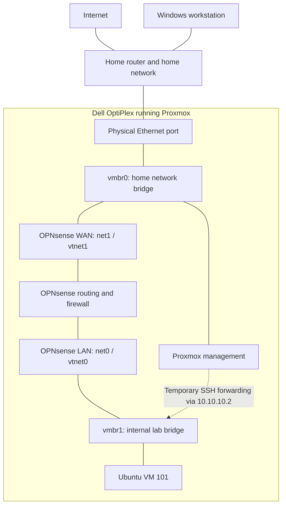

# Lab Architecture

> **Document status:** Living learning notes\
> **Last updated:** 2026-09-25\
> **Current work:** Proxmox foundation, OPNsense networking, and the Ubuntu baseline

## What I am building

This is my first hands-on IT lab. My background is in microbiology, so I am learning how servers, virtual machines, and networks fit together as I build them. I want these notes to explain why I chose a setting and how I checked it, including the parts I still need to understand or test.

I use a dedicated Dell OptiPlex to run several virtual machines, or VMs. Each VM acts like a separate computer with its own operating system. Proxmox manages those VMs, OPNsense handles traffic between the lab and my home network, and Ubuntu is where I am practicing Linux administration.

This document describes the setup recorded in the repository. The [security boundaries](security-boundaries.md) explain the protections and remaining gaps. The [lessons learned](lessons-learned.md) explain the problems I worked through.

## Where each project stands

| Project | What I have built | What remains |
|---|---|---|
| [LAB-01: Proxmox](../projects/01-proxmox-foundation/) | The physical host, storage, web management, and two virtual bridges | Independent backup and recovery work is still planned |
| [LAB-02: OPNsense](../projects/02-opnsense-segmentation/) | IPv4 lab networking and a logged block tested with one SSH connection | Broader protected-network, management-access, and IPv6 checks |
| [LAB-03: Ubuntu](../projects/03-ubuntu-server-baseline/) | The VM, separate accounts, recorded updates, hardened SSH, and active UFW | Full service/port/log review, independent firewall tests, and snapshot/rollback evidence |
| LAB-04 through LAB-09 | Plans in the [roadmap](../ROADMAP.md) | Implementation has not started |

The saved evidence records particular dates. Updating these notes does not mean that I reran the lab or collected a fresh system inventory.

## How the network fits together

A **bridge** is a virtual Ethernet switch. The two bridges in Proxmox let me connect VMs to different networks without buying another physical switch.

The solid lines show the normal network connections. The dotted line shows a temporary management path used during setup and Ubuntu administration; it needs to be enabled deliberately and cleaned up afterward. It is explained below because it changes how management traffic reaches the lab.

The home router still connects my household to the internet. OPNsense sits behind that router and manages a separate lab subnet, `10.10.10.0/24`. Its lab-side gateway address is `10.10.10.1`.

### Why WAN goes to vmbr0 and LAN goes to vmbr1

**WAN** is OPNsense's upstream side. In this setup, that means my existing private home network. **LAN** is its lab-facing side. These names describe the interfaces' jobs; WAN does not have to mean a public internet address.

| Connection | What it does in my lab |
|---|---|
| Physical Ethernet port → `vmbr0` | Connects Proxmox to the home network |
| Proxmox management → `vmbr0` | Lets my Windows workstation manage the host |
| OPNsense `net1` → `vmbr0`; guest name `vtnet1` | Gives OPNsense its WAN connection |
| OPNsense `net0` → `vmbr1`; guest name `vtnet0` | Gives OPNsense its LAN connection |
| Ubuntu `net0` → `vmbr1` | Places Ubuntu on the lab network |

I originally found the names confusing. Proxmox calls the OPNsense adapters `net0` and `net1`, while OPNsense calls them `vtnet0` and `vtnet1`. I checked the mapping on both systems instead of assuming that adapter zero must be WAN.

`vmbr1` has no physical uplink and no permanent Proxmox IPv4 address in the documented design. It is an internal switch, but that alone does not block every route to the home network. OPNsense supplies the normal routed connection, and its rules determine which traffic can pass. Adding a second adapter on `vmbr0` to a lab VM would give it another path around that design.

### What happens when Ubuntu connects to a website

1. Ubuntu gets its IPv4 settings from OPNsense using DHCP, which assigns network settings automatically.
2. Ubuntu uses the configured DNS service at `10.10.10.1` to look up a website's address.
3. Traffic for another network goes to its default gateway, also `10.10.10.1`.
4. OPNsense checks the applicable firewall policy and uses network address translation (NAT) for permitted outbound IPv4 traffic.
5. The traffic continues through `vmbr0` and the home router. Connection tracking helps the replies return to Ubuntu.

The [LAB-02 output](../projects/02-opnsense-segmentation/evidence/04-ubuntu-ipv4-egress.txt) records the lab address, gateway, DNS setting, and an HTTPS response. It demonstrates the tested connection. The current broad LAN allow rule is not a website or software-repository allowlist.

Two VMs on the same `vmbr1` subnet can communicate directly through that bridge. Their ordinary traffic does not pass through OPNsense. This is one reason I am also learning to configure Ubuntu's own firewall.

## How I manage the systems

| Task | Documented access path |
|---|---|
| Manage Proxmox | Windows workstation → home network → Proxmox on `vmbr0` |
| Open a VM console | Proxmox web interface → selected VM console |
| Reach the OPNsense LAN web interface during setup | SSH tunnel through Proxmox with a temporary lab-side address |
| Reach Ubuntu over SSH during LAB-03 | Local SSH forwarding through Proxmox; Ubuntu sees the connection from `10.10.10.2` |

For temporary LAN access, I used the runtime address `10.10.10.2/24` on Proxmox's `vmbr1`. This lets Proxmox open a connection to the lab-side destination on behalf of the workstation. That connection stays on the lab subnet and does not pass through OPNsense's routed LAN-to-WAN rules.

The LAB-02 notes record removal of the earlier temporary address and tunnel. Later LAB-03 work uses that management source again, and the September 25 UFW evidence permits SSH from `10.10.10.2`. The latest evidence does not include a new cleanup check. I therefore cannot describe the temporary address as currently absent based on the earlier cleanup alone.

This also explains why Ubuntu can receive an administrative SSH connection even though the LAB-02 test blocked an SSH connection going from Ubuntu toward a protected upstream destination. The source, destination, direction, and path are different.

OPNsense's WAN web interface is not part of the documented administration method. I have not configured home-router port forwarding for these management services. A complete management-access denial test is still outstanding.

## The physical host and storage

| Resource | Recorded setup |
|---|---|
| Computer | Dell OptiPlex 7090 SFF |
| Processor | Intel Core i7 |
| Memory | 32 GB RAM shared by Proxmox and active VMs |
| Storage | Local solid-state storage |
| Network | One active physical Ethernet connection |
| Proxmox node | `pve`; one standalone host |

Proxmox is installed directly on the OptiPlex. This is called a **bare-metal hypervisor**: it manages the physical computer and provides virtual hardware to the guest operating systems.

The two storage names initially looked interchangeable to me, but they have different uses:

| Storage | How I use it |
|---|---|
| `local` | Installation ISO files and other supported file content; the configured store also supports local backups |
| `local-lvm` | Virtual disks for the guest systems |

`local-lvm` uses thin provisioning, so a VM's advertised disk capacity does not have to be fully consumed on the physical drive immediately. I still need to watch actual free space as the VMs write data.

A backup saved on the same physical drive would still share that drive's failure risk. Independent backup storage and a tested restore are future work.

## The VMs I have now

| Setting | OPNsense | Ubuntu Server |
|---|---|---|
| VM ID | `100` | `101` |
| Role | Lab gateway and network firewall | Linux administration and security baseline |
| CPU | 2 virtual cores | 2 virtual cores |
| Memory shown in hardware evidence | 4 GiB, ballooning disabled | `2.00 GiB / 4.00 GiB`; both values are retained here rather than describing it as a fixed 2 GiB allocation |
| Main virtual disk | 32 GiB on `local-lvm` | 40 GiB on `local-lvm` |
| Firmware / machine | OVMF UEFI / Q35 | OVMF UEFI / Q35 |
| Network | WAN on `vmbr0`; LAN on `vmbr1` | One adapter on `vmbr1` |
| Recorded guest release | OPNsense 26.7 | Ubuntu 26.04.1 LTS |

These values come from the project evidence, including the [OPNsense hardware view](../projects/02-opnsense-segmentation/evidence/01-proxmox-opnsense-nics.png) and [Ubuntu hardware view](../projects/03-ubuntu-server-baseline/evidence/01-proxmox-ubuntu-hardware.png). I still need a configuration review to explain Ubuntu's memory settings fully.

I kept these systems as full VMs. OPNsense uses FreeBSD and needs its own operating-system kernel. Ubuntu gives me practice with a complete Linux system, including its boot process, accounts, services, firewall, and recovery. An LXC container shares the Proxmox Linux kernel; I may use unprivileged containers later for lightweight support services.

## How I plan to grow the lab

The [roadmap](../ROADMAP.md) keeps the detailed acceptance criteria. The order currently recorded there is:

| Lab | Planned purpose | Starting allocation, where defined |
|---|---|---|
| LAB-04: Windows 11 | Endpoint administration and security | 4 vCPU, 8 GB RAM, 80 GB disk |
| LAB-05: Windows Server / Active Directory | Accounts, permissions, DNS, and Group Policy | 4 vCPU, 6 GB RAM, 60 GB disk |
| LAB-06: Wazuh | Collect logs and investigate selected events | 4 vCPU, 8 GB RAM, 50 GB disk |
| LAB-07: Secure Clinical Laboratory | Connect the earlier work to fictional laboratory workflows | Application and additional resources still to be selected |
| LAB-08: Kali | Test selected controls on authorized lab systems | 2 vCPU, 4 GB RAM, 40 GB disk |
| LAB-09: Vulnerable targets | Assessment, remediation, and retesting | Depends on the selected target |

The healthcare project is where I want to connect my laboratory background with the IT skills I am learning. It will use synthetic orders, specimens, and results. Its workflow, access roles, and risks can be planned now; the application, monitoring, and recovery tests remain future work. This project does not establish experience administering Epic Beaker or a production LIS.

I have 32 GB of host memory, so I plan to run the VMs needed for each exercise and shut down the others. For example, the planned OPNsense, Windows Server, and Windows 11 allocations total about 18 GB of guest RAM, before Proxmox overhead. Actual usage will determine which combinations work comfortably.

OPNsense needs to start before guests that depend on its network services. Earlier setup notes record start-at-boot order 1 and a 30-second delay for OPNsense. The published hardware screenshot does not establish those options, and a full host-restart test is still pending.

## Decisions I want to remember

| ID | Choice | Why it matters to me |
|---|---|---|
| `ARCH-01` | Run Proxmox on dedicated hardware | Keep the lab separate from everyday workstation use |
| `ARCH-02` | Give `vmbr1` no physical uplink | Build an internal virtual network with the hardware I have |
| `ARCH-03` | Connect OPNsense to both bridges | Provide a place to route and filter traffic between the networks |
| `ARCH-04` | Keep normal Proxmox management on `vmbr0` | Retain an administration path when a lab VM or OPNsense has a problem |
| `ARCH-05` | Use a full VM for OPNsense | Support its FreeBSD kernel and infrastructure role |
| `ARCH-06` | Use a full VM for the first Ubuntu server | Learn full-system administration |
| `ARCH-07` | Use VirtIO virtual devices | Use devices designed for virtual machines |
| `ARCH-08` | Run selected groups of VMs | Work within the host's memory and storage limits |
| `ARCH-09` | Consider unprivileged LXC for benign support services | Explore lower resource use later; no containers are claimed as deployed |
| `ARCH-10` | Put future vulnerable applications inside disposable VMs | Keep a VM boundary between those applications and the host |

## What the architecture evidence supports

| Check | Recorded result |
|---|---|
| `ARC-VAL-01`: Proxmox starts and is manageable | Supported by LAB-01's published foundation record |
| `ARC-VAL-02`: `vmbr0` has the physical uplink | Shown in the bridge screenshot |
| `ARC-VAL-03`: `vmbr1` has no physical uplink | Shown in the bridge screenshot; temporary host addressing is a separate issue |
| `ARC-VAL-04`: OPNsense WAN/LAN mapping is correct | Supported by VM hardware and guest interface evidence |
| `ARC-VAL-05`: Ubuntu uses the OPNsense IPv4 path | Supported by DHCP and egress evidence |
| `ARC-VAL-06`: The controlled blocked flow reaches OPNsense | Supported by the timestamped SSH timeout and matching firewall log |
| `ARC-VAL-07`: IPv6 cannot bypass the intended boundary | Not yet tested |
| `ARC-VAL-08`: Startup order works after a host restart | Not yet demonstrated |
| `ARC-VAL-09`: Ubuntu returns to a clean snapshot state | Not yet tested |
| `ARC-VAL-10`: An independent backup can be restored | Planned |

My main limits are the single host, shared upstream/management bridge, one lab subnet, and local storage. OPNsense cannot protect the guests from a compromised hypervisor, and it does not inspect ordinary traffic between guests on the same subnet. Centralized monitoring and independent recovery are still planned.

## Change log

| Date | Change |
|---|---|
| 2026-09-25 | Rewrote the architecture as first-project learning notes; aligned Ubuntu progress, documented the temporary management path, and separated recorded settings from completed tests. |
| 2026-09-05 | Updated the planned sequence to put Windows, identity, and Wazuh before the healthcare capstone and authorized assessment labs. |
| 2026-09-03 | Corrected WAN/LAN adapter mapping and distinguished console administration from network traffic. |
| 2026-09-02 | Created the architecture record. |
