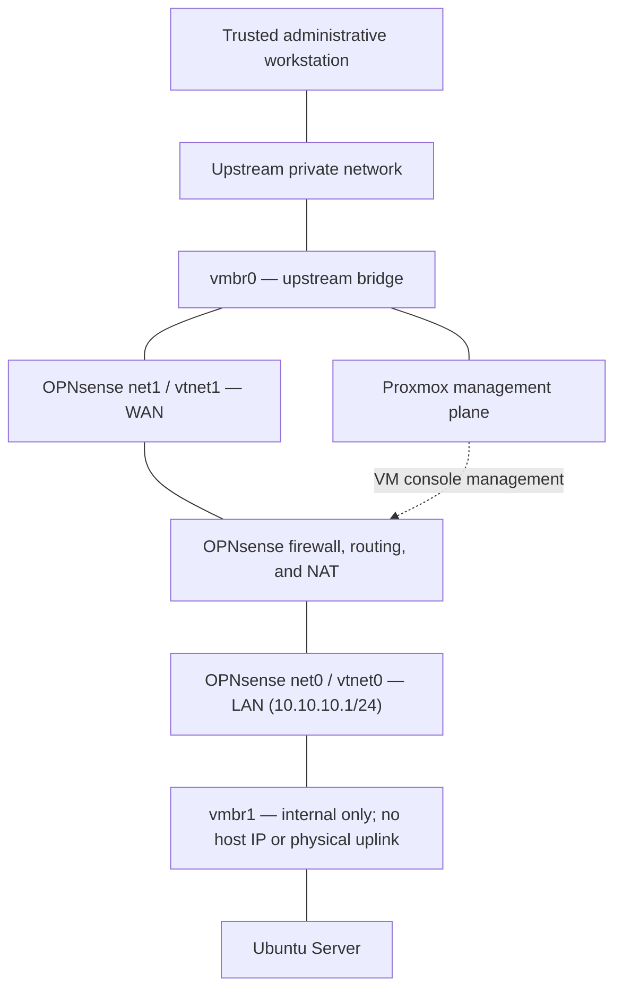

# Security Boundaries

> **Document status:** Living document  
> **Last updated:** 2026-09-03  
> **Lab phase:** Proxmox foundation, IPv4 network segmentation, and Ubuntu Server baseline  
> **Publication status:** Sanitized for a public portfolio

## 1. Purpose

This document defines the trust zones, permitted communication paths, security controls, validation methods, and known limitations of the Proxmox cybersecurity home lab.

The primary security objective is to let laboratory systems use approved network services without giving intentionally vulnerable or test systems an uncontrolled path to the home network, the Proxmox management plane, or the public internet.

The lab is used only for systems that I own or am explicitly authorized to test. It is not used to scan, exploit, or disrupt third-party systems.

## 2. Current Environment

The lab currently runs on a dedicated Dell OptiPlex 7090 SFF with Proxmox VE. Two Proxmox bridges separate the upstream network from the laboratory network:

| Component | Role | Current status |
|---|---|---|
| `vmbr0` | Upstream bridge connected to the physical Ethernet interface | **Operational** |
| `vmbr1` | Isolated virtual bridge with no physical uplink | **Operational** |
| OPNsense WAN (`net1` / `vtnet1`) | Connects OPNsense to `vmbr0` and the upstream private network | **Operational** |
| OPNsense LAN (`net0` / `vtnet0`) | Connects OPNsense to `vmbr1` | **Operational** |
| OPNsense | Provides IPv4 routing, DHCP, DNS forwarding, NAT, firewall policy, and logging | **Operational** |
| Ubuntu Server | First laboratory endpoint on `vmbr1` | **Baseline in progress** |

The public repository intentionally omits exact upstream IP addresses, MAC addresses, serial numbers, credentials, and configuration exports.

Solid lines show the current physical and virtual network path. The dotted line shows OPNsense console administration through Proxmox; it is a control path, not a bridged network connection. The OPNsense web GUI is not exposed on WAN.

OPNsense is the only intended Layer 3 path between `vmbr1` and the upstream network. A laboratory VM must not be given an additional adapter on `vmbr0`, because that would bypass this firewall path.

## 3. Protected Assets

The security boundaries are intended to protect:

- Personal computers and household devices on the home network
- Personal data and credentials stored outside the lab
- The Proxmox host and its management interface
- OPNsense administration and firewall configuration
- VM disks, snapshots, backups, and configuration records
- The integrity and repeatability of laboratory exercises
- External systems that are outside the authorized testing scope

## 4. Trust Zones

Trust is assigned according to function and exposure. A higher trust level does not mean a system is assumed to be invulnerable.

| Zone | Trust classification | Current members | Boundary expectation |
|---|---|---|---|
| Proxmox management plane | **High trust** | Proxmox web and administrative services | Reachable only through a trusted management path; not from lab endpoints |
| Upstream home network | **Protected** | Administrative workstation, router, and household devices | Must be protected from connections initiated by lab systems |
| OPNsense firewall | **Security-control plane** | OPNsense WAN, LAN, firewall, DHCP, NAT, and logs | Must be the controlled routed path between the upstream and lab networks |
| Isolated lab network | **Restricted / untrusted** | Ubuntu Server and future Kali, Windows, Wazuh, and target systems | Systems may be compromised during exercises and receive no implicit trust |
| Public internet | **Untrusted** | External networks and approved software repositories | Unsolicited inbound access is prohibited; outbound use is limited to authorized purposes |

The Proxmox management plane and OPNsense WAN currently share `vmbr0` with the upstream private network. They are separate logical roles but not physically separate networks. This is a known limitation of the current single-NIC design.

## 5. Security-Control Status

The following definitions are used throughout this document:

| Status | Meaning |
|---|---|
| **Verified** | Implemented and confirmed through a repeatable functional test or configuration review |
| **Configured** | Implemented, but complete functional validation is still pending |
| **Required** | Must be completed before intentionally vulnerable targets are introduced |
| **Planned** | Intended for a later phase of the lab |

| Control ID | Control | Status | Current evidence or next action |
|---|---|---|---|
| `SB-01` | `vmbr1` has no physical uplink | **Verified** | Confirmed in the Proxmox bridge configuration |
| `SB-02` | The Ubuntu lab endpoint connects to `vmbr1` rather than `vmbr0` | **Verified** | Confirmed through VM hardware and guest addressing |
| `SB-03` | OPNsense `net1` / `vtnet1` WAN connects to `vmbr0`, and `net0` / `vtnet0` LAN connects to `vmbr1` | **Verified** | Confirmed through Proxmox adapter assignments and interface operation |
| `SB-04` | OPNsense provides IPv4 DHCP, DNS forwarding, NAT, and permitted outbound access | **Verified** | Ubuntu received a lab address and reached approved internet services |
| `SB-05` | A specific IPv4 SSH restriction is evaluated before the general LAN allow rule | **Verified** | The controlled SSH attempt was denied and recorded in the OPNsense firewall log |
| `SB-06` | All IPv4 traffic from the lab subnet to protected home and management networks is denied by default | **Required** | Create or confirm a comprehensive logged block rule and test multiple protocols and management ports |
| `SB-07` | Proxmox and OPNsense management access is unavailable from lab endpoints | **Required** | Validate from `vmbr1`; restrict management rules to the designated administrative source |
| `SB-08` | IPv6 cannot bypass the IPv4 boundary | **Required** | Enforce equivalent IPv6 rules or disable unused IPv6 paths, then test |
| `SB-09` | Unsolicited inbound access from the internet is prohibited | **Configured** | No home-router port forwarding is used; external validation has not yet been documented |
| `SB-10` | Ubuntu uses a host-based UFW firewall | **Configured** | UFW is enabled; cross-host rule validation and documentation remain in progress |
| `SB-11` | Clean snapshots and recovery points exist before experiments | **Planned** | Create and test the Ubuntu baseline snapshot and rollback procedure |
| `SB-12` | Centralized monitoring records security events | **Planned** | Wazuh deployment is a later project phase |

The current evidence supports the claim that the IPv4 topology, OPNsense routing, and a representative firewall restriction work as intended. It does **not** yet support the broader claim that every protocol and path from the lab to the home or management network has been denied and tested.

## 6. Current and Intended Traffic Policy

| Source | Destination | Service or traffic | Policy | Validation status |
|---|---|---|---|---|
| Trusted administrative workstation | Proxmox management plane | Required management services | **Allow** from the trusted management path | Operational; source restriction should be documented |
| Trusted administrative workstation | OPNsense control plane | Proxmox VM console; explicitly authorized LAN-side HTTPS only when needed | **Allow** only as required | Proxmox console operational; WAN web GUI not exposed |
| Lab endpoint | OPNsense LAN interface | DHCP, DNS, and required gateway services | **Allow** | **Verified for IPv4** |
| Lab endpoint | Approved internet services | DNS and required update or repository traffic | **Allow through OPNsense** | **Verified for IPv4** |
| Lab endpoint | Designated upstream SSH test destination | TCP destination port 22 | **Deny and log** | **Verified** |
| Lab subnet | Entire protected home subnet | Any traffic | **Deny and log by default** | **Required before vulnerable targets** |
| Lab subnet | Proxmox and OPNsense management services | Any unauthorized management traffic | **Deny and log** | **Required before vulnerable targets** |
| Internet | Lab systems | Unsolicited inbound traffic | **Deny** | Enforced by layered NAT/firewall design; formal external test pending |
| Lab system | Another system on the same lab subnet | East-west traffic | **Allowed unless a host control blocks it** | Current architectural limitation |
| Lab systems | Third-party systems | Scanning, exploitation, or disruptive traffic | **Prohibited** | Administrative policy |

### Same-subnet traffic limitation

Systems attached to the same `vmbr1` subnet can exchange Layer 2 traffic directly. That traffic does not have to pass through OPNsense, so OPNsense cannot be assumed to inspect or block communication between two systems on the same subnet.

Host firewalls, separate subnets, VLANs, or additional OPNsense interfaces will be required if future exercises need isolation between individual lab systems.

## 7. Firewall Policy Principles

The following principles govern OPNsense rule creation:

1. Rules are placed on the interface where traffic enters OPNsense.
2. Specific deny rules appear above broader allow rules.
3. Source ports normally remain `any` because clients use temporary source ports.
4. Destination ports identify the requested service, such as TCP 22 for SSH.
5. Rules use the narrowest practical source, destination, protocol, and service.
6. Security-relevant deny rules are logged so functional tests can be correlated with firewall evidence.
7. A rule is not considered verified merely because it appears in the interface; an expected allow or deny result must be generated and observed.
8. Temporary troubleshooting rules are removed or disabled after testing.

## 8. Administrative Access Policy

- Proxmox administration is performed from a trusted workstation on the upstream private network.
- OPNsense console administration is reached through the Proxmox management plane; the OPNsense web GUI is not exposed on WAN.
- Initial GUI bootstrap used a temporary LAN-side Proxmox path and SSH tunnel that were removed after setup.
- Management interfaces must not be exposed through home-router port forwarding.
- Remote management from the public internet is not permitted.
- Future remote access, if needed, will use a deliberately configured VPN rather than direct management-port exposure.
- Administrative and standard accounts are separated where the operating system supports that workflow.
- Strong, unique credentials are required and must not be stored in this repository.
- Private keys, tokens, recovery codes, raw firewall backups, and unsanitized configuration exports are excluded from version control.
- Management rules should identify the designated administrative source rather than allow the entire lab network.
- Management access is periodically retested from both an authorized workstation and an unauthorized lab endpoint.

## 9. Vulnerable-System and Testing Rules

No intentionally vulnerable operating system should be introduced until controls `SB-06`, `SB-07`, and `SB-08` are complete.

When vulnerable targets or offensive testing systems are added:

- Kali and vulnerable targets connect only to `vmbr1` or a later, more restricted lab segment.
- A target must never receive a second adapter connected to `vmbr0`.
- Testing is limited to explicitly identified systems owned by the lab operator.
- The scope, source, target, permitted techniques, and stopping conditions are documented before testing.
- Clean snapshots are created before exercises and restoration is tested.
- Vulnerable systems remain powered off when not required.
- Unknown malware, ransomware, persistence against the Proxmox host, and container-escape or hypervisor-escape testing are prohibited.
- Vulnerable web applications should run inside a disposable VM rather than directly in an LXC container on the Proxmox host.
- LXC containers used for benign support services should be unprivileged.
- Internet-wide scanning and testing of public systems are prohibited.
- Outbound internet access is reduced or removed when a target does not need it.

## 10. Validation Record

Detailed screenshots and command output belong in the corresponding project evidence folders. This table records the high-level result without publishing sensitive network details.

| Test ID | Test | Expected result | Current result |
|---|---|---|---|
| `VAL-01` | Start Ubuntu on `vmbr1` and request network configuration | Address, gateway, and DNS supplied through OPNsense | **Pass** |
| `VAL-02` | Access an approved internet resource from Ubuntu | Traffic passes through OPNsense and NAT | **Pass** |
| `VAL-03` | Initiate the controlled upstream SSH connection | Connection is denied by the intended rule | **Pass** |
| `VAL-04` | Filter OPNsense logs for the Ubuntu source address | Matching denied connection is visible | **Pass** |
| `VAL-05` | Test multiple protocols from the lab subnet to a designated protected test host | All unauthorized traffic is denied and logged | **Not yet performed** |
| `VAL-06` | Attempt to reach Proxmox management services from Ubuntu | Connection is denied and logged | **Not yet performed** |
| `VAL-07` | Inspect and test IPv6 addressing and routes | No IPv6 path bypasses the intended boundary | **Not yet performed** |
| `VAL-08` | Test Ubuntu UFW from another lab endpoint | Only documented host services are reachable | **Waiting for a second endpoint** |
| `VAL-09` | Restore Ubuntu from a clean baseline snapshot | VM returns to the documented working state | **Not yet performed** |

## 11. Known Limitations and Residual Risk

### Single physical host

The lab firewall and its protected systems run on the same Proxmox host. OPNsense separates guest-network traffic, but it cannot protect the environment if the Proxmox hypervisor itself is compromised.

### Single physical network interface

`vmbr0` carries both Proxmox management traffic and the OPNsense upstream connection. The design provides useful logical segmentation but not physical separation of the management and upstream networks.

### Upstream NAT

OPNsense operates behind the home router rather than serving as the household internet-edge firewall. The home router provides the first NAT/firewall layer, and OPNsense provides a second security boundary for the lab.

### Partial firewall validation

The SSH-denial test proves that the tested rule, protocol, direction, and IPv4 path behaved correctly. It does not prove that all other protocols, destinations, management services, or IPv6 paths are blocked.

### East-west visibility

OPNsense does not see normal traffic exchanged directly between systems on the same `vmbr1` subnet. Host firewalls or additional segmentation will be required for fine-grained internal isolation.

### Limited monitoring and recovery evidence

Centralized monitoring, independent backups, and tested recovery procedures have not yet been completed. Until those projects are operational, logging and recovery capabilities are limited to the controls available on each individual system and Proxmox.

### Proxmox firewall dependency

OPNsense is the primary lab firewall. Proxmox firewall checkboxes or defaults are not treated as active security controls unless the relevant global, node, and guest rules are explicitly configured and tested.

## 12. Required Work Before Vulnerability Testing

- [ ] Create or confirm an alias representing every protected upstream and management subnet.
- [ ] Place a logged `lab network → protected networks → any` block rule above the general internet-access rule.
- [ ] Verify denial using a designated test host and several representative protocols.
- [ ] Confirm that Proxmox and OPNsense management services cannot be reached from `vmbr1` except through a deliberately authorized path.
- [ ] Validate IPv6 isolation or disable unused IPv6 functionality consistently.
- [ ] Review OPNsense management access and restrict it to the designated administrative source and required service.
- [ ] Export an OPNsense configuration backup and store it privately outside the public repository.
- [ ] Create clean snapshots of systems that will participate in testing.
- [ ] Document the authorized scope and rules of engagement for the first assessment.
- [ ] Re-run the allowed and denied traffic tests after every major firewall change.

## 13. Public Evidence Standard

Public evidence should demonstrate the control without revealing sensitive information. Acceptable evidence includes:

- A sanitized diagram showing `vmbr0`, OPNsense, and `vmbr1`
- Proxmox hardware views showing correct bridge assignments with MAC addresses removed
- OPNsense rule screenshots with private upstream details obscured
- Firewall-log excerpts showing the expected action, direction, protocol, and sanitized endpoints
- Short command outputs demonstrating guest addressing, routes, listening services, or UFW status
- A written explanation of the expected result, observed result, and security significance

Evidence must not contain passwords, tokens, private keys, public IP addresses, MAC addresses, serial numbers, raw configuration backups, or unrelated personal information.

## 14. Current Portfolio Claim

The following statement accurately represents the current level of validation:

> Implemented an isolated IPv4 laboratory network in Proxmox using an internal-only virtual bridge and a two-interface OPNsense firewall. Configured DHCP, DNS forwarding, NAT, and ordered firewall policy; validated a controlled SSH restriction from an Ubuntu endpoint and correlated the denied connection with OPNsense firewall logs. Comprehensive management-network and IPv6 isolation testing remains in progress.

## 15. Change Log

| Date | Change |
|---|---|
| 2026-09-03 | Corrected the adapter-level WAN/LAN mapping in the topology and distinguished Proxmox console management from network traffic through OPNsense. |
| 2026-09-02 | Created the initial security-boundary document from the verified Proxmox, OPNsense, and Ubuntu lab state. |
