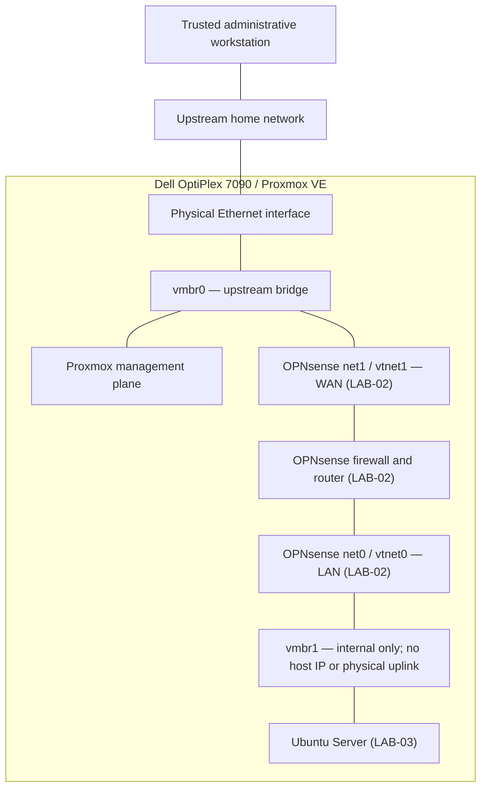

# Project 01: Proxmox Foundation

> **Project status:** Verified  
> **Last updated:** 2026-09-03  
> **Platform:** Dell OptiPlex 7090 SFF running Proxmox VE  
> **Portfolio status:** Published

## 1. Objective

Deploy a dedicated bare-metal virtualization platform capable of supporting a segmented cybersecurity laboratory.

The project established the underlying compute, storage, management, and virtual-networking foundation required for later OPNsense, Linux, Windows, Active Directory, vulnerability-testing, monitoring, and recovery projects.

## 2. Scope

This project includes:

- Preparing Proxmox installation media
- Installing Proxmox VE on dedicated hardware
- Establishing trusted management access
- Configuring appropriate software repositories
- Installing available updates
- Reviewing Proxmox storage roles
- Confirming the upstream `vmbr0` bridge
- Creating the internal-only `vmbr1` bridge
- Validating the resulting host and virtual-network configuration

This project does not include OPNsense firewall policy, Ubuntu hardening, Windows administration, or vulnerability testing. Those subjects are documented as separate projects.

## 3. Environment

### Physical platform

| Component | Configuration |
|---|---|
| Host | Dell OptiPlex 7090 SFF |
| Processor | Intel Core i7 |
| Memory | 32 GB RAM |
| Storage | Local solid-state storage managed by Proxmox |
| Networking | One active physical Ethernet connection |
| Primary role | Dedicated cybersecurity virtualization host |

### Software and administration

| Component | Purpose |
|---|---|
| Proxmox VE | Bare-metal hypervisor and management platform |
| Rufus | Created the bootable installation USB |
| Web browser | Accessed the Proxmox management interface |
| Trusted Windows workstation | Performed routine remote administration |

Exact IP addresses, MAC addresses, serial numbers, and storage-device identifiers are intentionally omitted from this public documentation.

## 4. Foundation Architecture

This diagram shows how the LAB-01 bridge foundation is used in the current topology. OPNsense and Ubuntu are included to keep the interface mapping consistent across the repository; their implementation and validation belong to LAB-02 and LAB-03 rather than this project.

- `vmbr0` connects the physical Ethernet interface, Proxmox management plane, and OPNsense `net1` / `vtnet1` WAN.
- `vmbr1` exists only inside the Proxmox host, has no host IP or physical uplink, and connects OPNsense `net0` / `vtnet0` LAN to Ubuntu.
- OPNsense now provides the controlled routed path between the two bridges.
- A bridge provides virtual switching; it does not independently provide routing or firewall enforcement.

The complete current topology is documented in [`architecture.md`](../../docs/architecture.md).

## 5. Implementation Summary

### 5.1 Installation media

A bootable Proxmox installation USB was prepared with Rufus and used to install Proxmox directly on the dedicated OptiPlex.

Installing Proxmox as a bare-metal hypervisor allows it to manage the host’s processor, memory, storage, and network interfaces directly rather than running inside another operating system.

### 5.2 Proxmox installation

Proxmox VE was installed on the host’s local storage. The installation established:

- The Proxmox operating system
- The `pve` node
- Local management credentials
- An upstream management connection
- Default local storage pools
- The initial `vmbr0` bridge

The management interface was then accessed from a trusted workstation on the upstream private network.

### 5.3 Repository configuration and updates

The enterprise repository was disabled because the lab does not use a paid Proxmox subscription. The official no-subscription repository was enabled, and available operating-system and Proxmox updates were installed.

This removed subscription-related repository errors while retaining access to the appropriate community update channel.

### 5.4 Storage review

The two primary Proxmox storage locations serve different purposes:

| Storage | Primary purpose |
|---|---|
| `local` | ISO images, container templates, and selected backup files |
| `local-lvm` | VM and LXC virtual disks |

This distinction became important when uploading installation media and creating virtual disks. An ISO belongs on `local`, while a guest operating-system disk normally belongs on `local-lvm`.

`local-lvm` uses thin provisioning. A virtual disk’s maximum capacity is not necessarily consumed immediately; physical usage increases as the guest writes data.

### 5.5 Upstream bridge

The existing `vmbr0` bridge was confirmed as the upstream bridge.

It connects:

- The physical Ethernet interface
- The Proxmox management plane
- The OPNsense `net1` / `vtnet1` WAN interface, implemented in LAB-02

A system connected to `vmbr0` can potentially communicate with the upstream home network. Intentionally vulnerable lab systems must therefore not connect directly to this bridge.

### 5.6 Isolated bridge

A second Linux bridge named `vmbr1` was created with:

- No physical bridge port
- No direct connection to the home router
- No Proxmox management role
- An active internal virtual-switch state

The bridge currently carries traffic between the OPNsense `net0` / `vtnet0` LAN interface and the Ubuntu laboratory guest.

Creating `vmbr1` provides an internal virtual network without requiring a separate physical switch. By itself, the bridge provides no routing or firewall enforcement; OPNsense supplies those functions in the current topology.

## 6. Security Reasoning

### Dedicated hardware

Using a separate physical computer reduces interference with normal personal-computer use and provides a controlled platform for experiments, snapshots, and guest operating systems.

### Trusted management path

Proxmox administration remains on the upstream private network rather than the isolated laboratory bridge. This keeps routine hypervisor management separate from future test endpoints.

### Internal-only bridge

Leaving `vmbr1` without a physical uplink prevents its guests from reaching the physical network directly through that bridge.

This isolation can still be bypassed by an incorrect VM configuration. For example, adding a second `vmbr0` adapter to a vulnerable guest would provide another network path. Guest adapter assignments must therefore be reviewed before startup.

### No exposed services

The lab does not use home-router port forwarding to expose Proxmox or future vulnerable services to the public internet.

Detailed trust zones and required security controls are documented in [`security-boundaries.md`](../../docs/security-boundaries.md).

## 7. Validation

| Test ID | Validation | Expected result | Result |
|---|---|---|---|
| `PVE-VAL-01` | Boot the physical host | Proxmox starts successfully | **Pass** |
| `PVE-VAL-02` | Open the management interface from the trusted workstation | Proxmox login page is reachable | **Pass** |
| `PVE-VAL-03` | Refresh configured repositories | Appropriate repositories respond without enterprise-subscription errors | **Pass** |
| `PVE-VAL-04` | Install available updates | Update process completes successfully | **Pass** |
| `PVE-VAL-05` | Review Proxmox storage | `local` and `local-lvm` are available for their intended roles | **Pass** |
| `PVE-VAL-06` | Review `vmbr0` | Bridge is active and connected to the physical interface | **Pass** |
| `PVE-VAL-07` | Review `vmbr1` | Bridge is active with no physical uplink | **Pass** |

Later OPNsense and Ubuntu work provided cross-project confirmation that isolated guests can use `vmbr1`. That integration evidence belongs to `LAB-02` and `LAB-03`; it is not required to validate the Proxmox foundation itself.

## 8. Evidence

The evidence index, validation traceability, captions, and sanitization record are maintained in [`evidence/README.md`](evidence/README.md).

The [published evidence pack](evidence/) contains six selected artifacts that support the validation results:

| Evidence ID | Required artifact | Status |
|---|---|---|
| `PVE-E01` | Sanitized node Summary screenshot | **Published** |
| `PVE-E02` | Sanitized repository configuration screenshot | **Published** |
| `PVE-E03A` | Sanitized `local` storage overview screenshot | **Published** |
| `PVE-E03B` | Sanitized `local-lvm` storage overview screenshot | **Published** |
| `PVE-E04` | Sanitized `vmbr0` and `vmbr1` configuration screenshot | **Published** |
| `PVE-E05` | Complete `pveversion -v` text output | **Published** |

Together, these artifacts document the operational node, repository configuration, storage roles, virtual bridges, and installed platform versions without exposing the removed network and hardware identifiers.

## 9. Problems Encountered

### Enterprise repository required a subscription

**Observed behavior:** The default enterprise repository could not be used without a valid subscription.

**Resolution:** Disabled the enterprise repository, enabled the official no-subscription repository, refreshed package information, and installed available updates.

**Lesson:** Repository selection must match the organization’s licensing and support model. Disabling one repository is not sufficient unless an appropriate update source is also enabled.

### Storage locations served different purposes

**Observed issue:** `local` and `local-lvm` appeared similar in the interface but did not accept the same content types.

**Resolution:** Used `local` for installation ISOs and `local-lvm` for guest virtual disks.

**Lesson:** A storage pool’s configured content types determine how it should be used.

### Virtual bridge roles required clarification

**Observed issue:** The positions of `vmbr0` and `vmbr1` were initially confusing in the network diagram.

**Resolution:** Traced each bridge through its physical and virtual attachments and corrected the diagram.

**Lesson:** A bridge name does not define its role. Its physical port, guest connections, IP configuration, and routing determine its actual function.

Additional troubleshooting details are maintained in [`lessons-learned.md`](../../docs/lessons-learned.md).

## 10. Skills Demonstrated

- Bare-metal hypervisor installation
- Bootable installation-media preparation
- Proxmox web administration
- Linux software-repository management
- Operating-system patching
- Virtual storage-pool interpretation
- Linux bridge configuration
- Physical versus virtual network-path analysis
- Secure network-design planning
- Configuration validation
- Technical documentation and evidence sanitization

## 11. Limitations

- The lab currently uses one physical Proxmox host.
- High availability is not available.
- Proxmox management and OPNsense WAN share the upstream bridge.
- The host currently uses one active physical network interface.
- VM disks and snapshots depend on local host storage.
- An independent backup-and-restore process has not yet been validated.
- Resource limits require task-specific VM operating groups.
- `vmbr1` alone does not provide firewall enforcement; OPNsense supplies the routed security boundary.

## 12. Outcome

The completed foundation provides:

- A stable Proxmox virtualization host
- Trusted remote management
- Updated system software
- Defined ISO and virtual-disk storage roles
- An operational upstream bridge
- An operational internal-only lab bridge
- A bridge foundation subsequently used by the OPNsense and Ubuntu projects

This foundation supports the next two projects:

1. OPNsense network segmentation and firewall validation
2. Ubuntu Server administration and security baseline

## 13. Related Documentation

- [Lab architecture](../../docs/architecture.md)
- [Security boundaries](../../docs/security-boundaries.md)
- [Lessons learned](../../docs/lessons-learned.md)
- [Project roadmap](../../ROADMAP.md)

## 14. Change Log

| Date | Change |
|---|---|
| 2026-09-03 | Updated the foundation diagram to show the verified current OPNsense adapter mapping and Ubuntu attachment while preserving LAB-01 scope. |
| 2026-09-03 | Published the sanitized evidence pack with validation mapping and concise captions. |
| 2026-09-02 | Created the initial Proxmox Foundation project documentation. |
