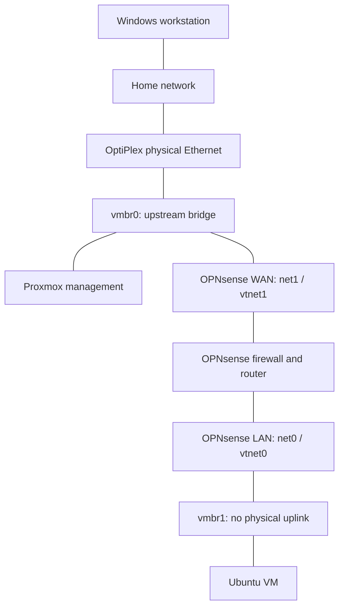

# Project 01: Proxmox Foundation

> **Project status:** Verified for the foundation scope below\
> **Portfolio status:** Published\
> **Platform:** Dell OptiPlex 7090 SFF running Proxmox VE\
> **Last updated:** 2026-09-25

## What I wanted to learn

This was my starting point for building an IT lab. My background is in microbiology, and I had not built a virtualization environment before. I wanted a separate computer where I could install operating systems, make changes, and learn how to check the results.

I installed Proxmox directly on a Dell OptiPlex. Proxmox is a hypervisor: it manages the physical computer and lets me run virtual machines, each with its own operating system. This project established the host, storage, management access, and virtual networking used by the later labs.

## What I used

| Component | Recorded setup or purpose |
|---|---|
| Computer | Dell OptiPlex 7090 SFF |
| Processor and memory | Intel Core i7 and 32 GB RAM |
| Storage | Local solid-state storage |
| Network | One active physical Ethernet connection to the home network |
| Installation tool | Rufus, used to create the bootable USB |
| Administration | Proxmox web interface from my Windows workstation |
| Proxmox node | `pve` |

The [evidence pack](evidence/README.md) records the captured platform versions and configuration. Upstream addresses and unnecessary hardware identifiers are removed from the public copies.

## How this foundation connects to the other labs

I created the bridge foundation in this project. OPNsense and Ubuntu are shown to explain how LAB-02 and LAB-03 use it. The [architecture notes](../../docs/architecture.md) also describe the temporary LAN-side Proxmox address used for administration; this diagram shows the normal connections.

A bridge works like a virtual Ethernet switch. `vmbr0` connects to the physical network and carries Proxmox management and OPNsense WAN. `vmbr1` has no physical uplink and connects the lab guests to OPNsense LAN. OPNsense provides routing and firewall rules between the two networks.

## What I did and why

### Installed Proxmox on the dedicated computer

I prepared the USB with Rufus, installed Proxmox on the OptiPlex, and opened its management interface from my workstation. Installing directly on the hardware gives Proxmox responsibility for the host's processor, memory, disks, and virtual devices.

Using a dedicated machine keeps these experiments separate from my everyday workstation, although the lab still shares my home network through its upstream connection.

### Corrected the update repositories

The enterprise repository produced subscription-related errors because this lab does not have a paid subscription. I disabled the enterprise source, enabled the official no-subscription source, refreshed package information, and installed the available updates.

I learned that a repository is a source of software packages and updates. Removing an unusable source was only part of the fix; I also needed an appropriate source enabled so updates could continue.

### Learned the storage roles

| Storage | How I use it |
|---|---|
| `local` | ISO installation images and other supported files; the configured store also supports local backups |
| `local-lvm` | Virtual disks for the guest operating systems |

At first, these looked like two versions of the same storage menu. The supported content types explained why an installation ISO and a VM disk belonged in different places.

`local-lvm` uses thin provisioning, so a virtual disk's maximum size is not necessarily consumed immediately. I still need to monitor the actual storage remaining as guests write data.

### Checked vmbr0 and created vmbr1

I confirmed that `vmbr0` used the physical Ethernet interface, then created `vmbr1` without a physical bridge port or permanent Proxmox IPv4 address.

This gave the lab an internal virtual switch. It did not by itself create a complete security policy. Later, OPNsense supplied the routed connection and rules. An incorrectly added `vmbr0` adapter on a lab guest could bypass that intended path, so adapter assignments are part of my checks.

## What I checked

| Check | Recorded result and evidence limit |
|---|---|
| `PVE-VAL-01`: Host boots | The published node summary shows an online Proxmox host |
| `PVE-VAL-02`: Workstation management access | The setup record and captured web interface show working access |
| `PVE-VAL-03`: Repository setup | The repository screenshot shows enterprise sources disabled and no-subscription enabled; the setup notes record successful refresh |
| `PVE-VAL-04`: Available updates installed | Completion is recorded in the setup notes; `pveversion -v` preserves the installed versions, not a full upgrade transcript |
| `PVE-VAL-05`: Storage roles | The `local` and `local-lvm` screenshots show their types and supported content |
| `PVE-VAL-06`: Upstream bridge | The network screenshot shows `vmbr0` attached to the physical interface |
| `PVE-VAL-07`: Internal bridge | The same screenshot shows `vmbr1` active with no physical bridge port |

The foundation is marked verified within that scope. These captures describe the saved setup and do not establish current patch status or complete network isolation.

The [evidence index](evidence/README.md) contains six artifacts: a node summary, repository configuration, two storage views, a bridge view, and the version output. LAB-02 and LAB-03 provide the later guest-network and host-security evidence.

## What confused me and what I learned

The subscription error taught me to check where updates come from. The storage menus taught me to distinguish installation files from guest disks. The bridge diagram required me to trace the real connections before I could explain the network.

The most useful habit was to connect a setting to its purpose. Instead of remembering only that I created `vmbr1`, I can explain that leaving out a physical uplink creates an internal virtual switch and that a separate firewall is responsible for routed access.

The longer [lessons learned](../../docs/lessons-learned.md) also cover disk-versus-memory confusion, ISO checksums, and repository path mistakes.

## Security choices and limits

I keep normal Proxmox administration on the home-network side and have not configured router port forwarding for lab management. Temporary LAN-side administration is an explicit exception documented in the [security boundaries](../../docs/security-boundaries.md).

This remains one physical host with one active network interface. Proxmox management and OPNsense WAN share `vmbr0`. A host or storage failure can affect every VM, and an independent backup/restore process has not been tested. A snapshot would help with rollback but would still depend on the same storage.

## Where this leaves me

I have a working platform for the next exercises and a better understanding of virtual machines, storage, and network bridges. The skills I practiced here were installation-media preparation, Proxmox administration, repository selection, updates, storage review, bridge configuration, and documenting the result.

OPNsense networking is documented in [LAB-02](../02-opnsense-segmentation/), and the ongoing Ubuntu baseline is in [LAB-03](../03-ubuntu-server-baseline/). Future projects remain in the [roadmap](../../ROADMAP.md).

## Change log

| Date | Change |
|---|---|
| 2026-09-25 | Rewrote the project around what I did and learned; clarified evidence limits and the temporary management exception. |
| 2026-09-03 | Aligned the diagram with the OPNsense adapter mapping and published the sanitized evidence pack. |
| 2026-09-02 | Created the Proxmox Foundation write-up. |
