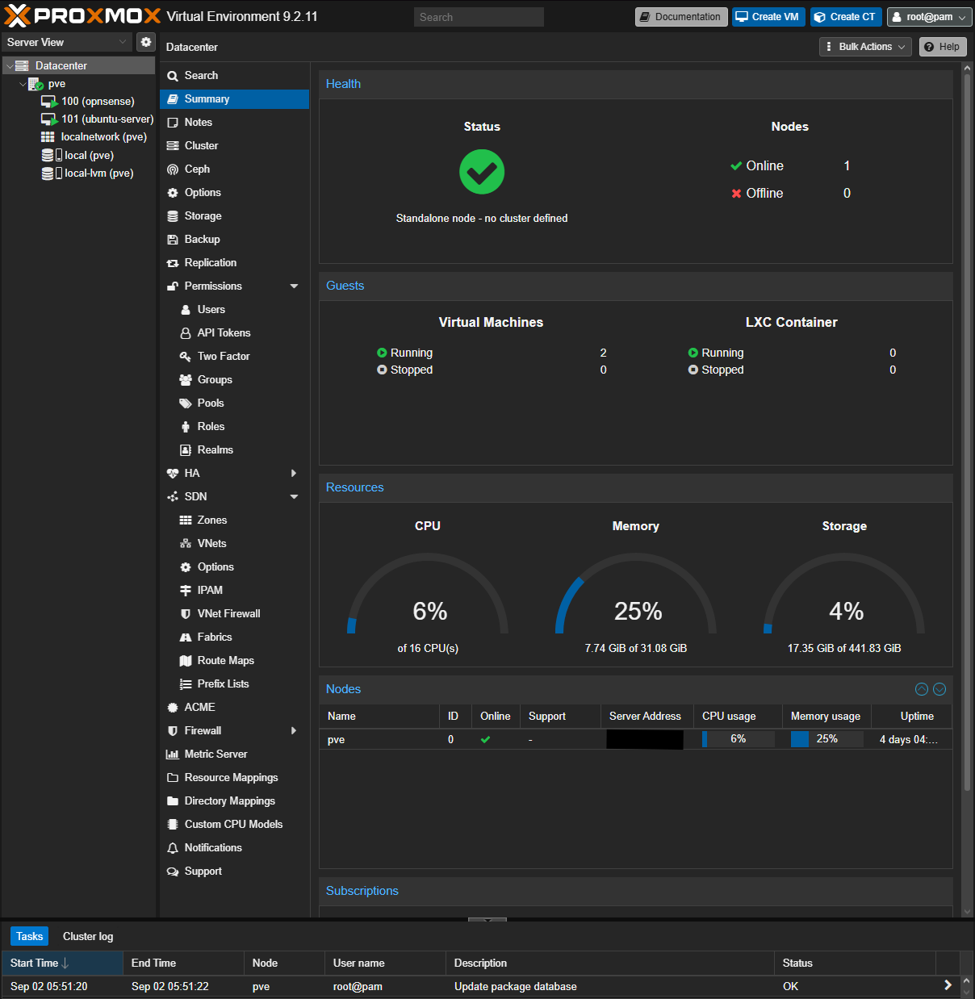
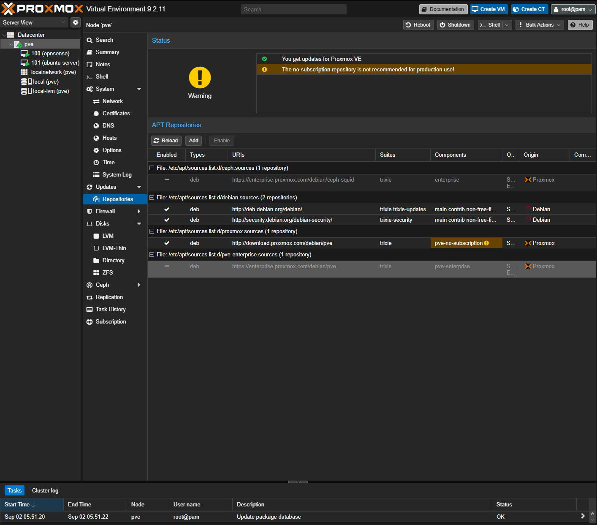
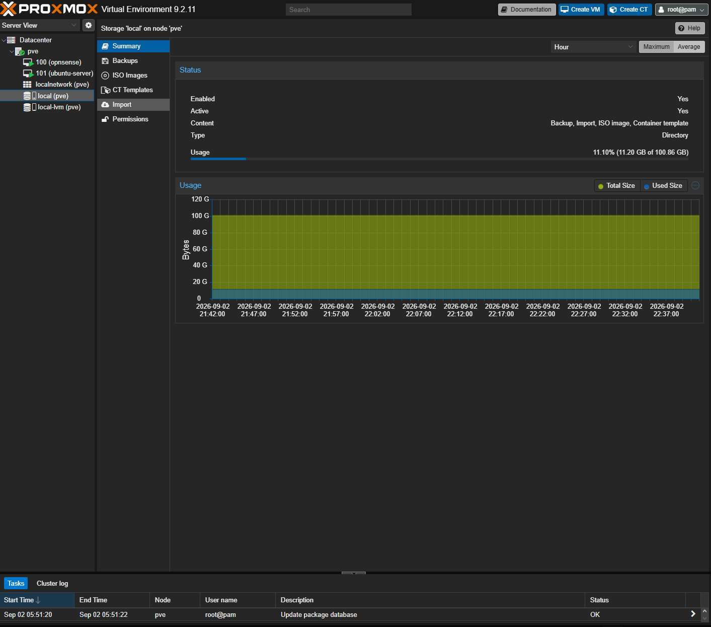
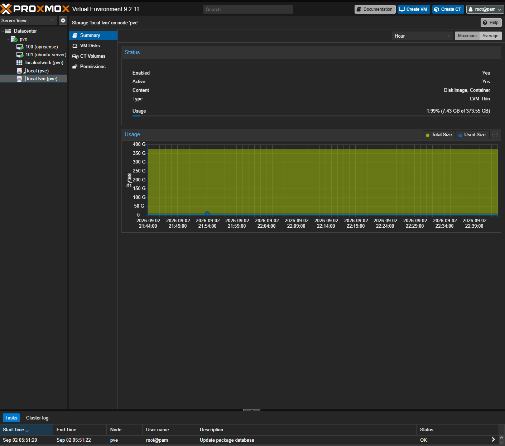
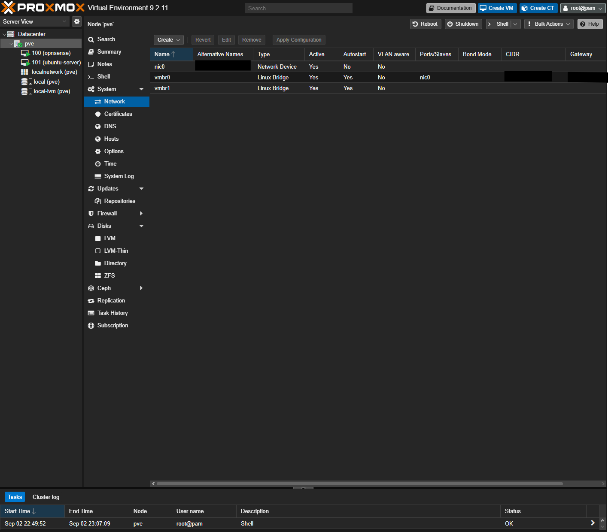

# LAB-01 Evidence Pack

> **Technical status:** Verified\
> **Portfolio status:** Published\
> **Platform captured:** Proxmox VE 9.2.11\
> **Evidence captured:** 2026-09-02\
> **Last reviewed:** 2026-09-03\
> **Documentation revised:** 2026-09-25

## 1. Purpose

I kept these six artifacts so I can connect the [Proxmox project explanation](../README.md) to the settings I recorded. They show the foundation at capture time. The version output records installed packages; it is not a complete upgrade transcript or a current patch assessment.

## 2. Evidence Index

| Evidence ID | Artifact | Review status | What it proves |
|---|---|---|---|
| `PVE-E01` | [`01-node-summary.png`](01-node-summary.png) | **Published** | One standalone Proxmox node is online with approximately 32 GB RAM and two running virtual machines |
| `PVE-E02` | [`02-repositories.png`](02-repositories.png) | **Published** | Enterprise repositories are disabled and the official no-subscription repository is enabled |
| `PVE-E03A` | [`03-local-pve-storage-overview.png`](03-local-pve-storage-overview.png) | **Published** | `local` is active directory storage for backups, imports, ISO images, and container templates |
| `PVE-E03B` | [`03-local-lvm-pve-storage-overview.png`](03-local-lvm-pve-storage-overview.png) | **Published** | `local-lvm` is active LVM-thin storage for guest disk images and containers |
| `PVE-E04` | [`04-network-bridges.png`](04-network-bridges.png) | **Published** | `vmbr0` uses the physical interface while `vmbr1` is active, starts automatically, and has no physical bridge port |
| `PVE-E05` | [`05-pveversion.txt`](05-pveversion.txt) | **Published** | The exact Proxmox VE, manager, kernel, and component versions present at evidence collection |

## 3. Selected Evidence

### `PVE-E01` — Operational node

> **Proxmox Datacenter Summary showing one online standalone node, approximately 32 GB RAM, and two running virtual machines. The server address is redacted.**

Related validation: `PVE-VAL-01` and `PVE-VAL-02`.

### `PVE-E02` — Repository configuration

> **Repository configuration showing the enterprise sources disabled and the official no-subscription source enabled for this non-subscription lab host.**

Related validation: `PVE-VAL-03`.

### `PVE-E03A` — Local content storage

> **The active `local` directory store is configured for backups, imports, ISO images, and container templates, separating installation content from guest-disk storage.**

Related validation: `PVE-VAL-05`.

### `PVE-E03B` — Thin-provisioned guest storage

> **The active `local-lvm` LVM-thin pool provides approximately 373.55 GB for virtual-machine disk images and containers.**

Related validation: `PVE-VAL-05`.

### `PVE-E04` — Virtual bridges

> **Bridge configuration showing `vmbr0` attached to the host’s physical interface and `vmbr1` active with autostart enabled and no physical bridge port. Network addressing and hardware identifiers are redacted.**

Related validation: `PVE-VAL-06` and `PVE-VAL-07`.

### `PVE-E05` — Installed versions

The complete sanitized command output is available in [`05-pveversion.txt`](05-pveversion.txt).

> **Installed Proxmox VE and component versions recorded when the LAB-01 evidence pack was finalized.**

The login banner and identifying shell prompt were removed. The `pveversion -v` output itself was preserved without modification.

## 4. Sanitization Record

Removed or obscured:

- Proxmox management server address
- `vmbr0` CIDR and gateway
- Login banner and shell prompt from the version record
- MAC-derived interface identifier in the Network view

Intentionally retained because it supports the documented claims:

- Node alias `pve`
- Proxmox and component versions
- Official repository URLs and enabled/disabled states
- Storage names, types, content roles, and capacity
- Bridge names, active state, autostart state, and generic physical-port name
- Lab-only VM IDs and descriptive guest names

No password, token, private key, subscription credential, public IP address, serial number, UUID, or configuration backup is included.

## 5. Scope Boundary

These artifacts demonstrate the Proxmox foundation only. OPNsense interface mapping, firewall rules, denied-traffic logs, Ubuntu addressing, and broader lab-to-home isolation belong in later project evidence packs.

The empty physical-port field on `vmbr1` shows that it has no physical uplink. It does not establish complete firewall or management isolation. The static bridge view also cannot prove that a temporary runtime host address is absent during later administration; that exception is explained in the [architecture](../../../docs/architecture.md).

## 6. Publication Verification

The evidence-content review is complete:

- [x] All six required artifacts are present.
- [x] Every screenshot is legible and supports its assigned claim.
- [x] Network addresses and hardware identifiers are obscured.
- [x] The version record contains the complete command output without its login banner or identifying shell prompt.
- [x] Captions state only what each artifact visibly demonstrates.

The evidence directory, project README, and roadmap are published together so the supporting artifacts and portfolio status remain consistent.
