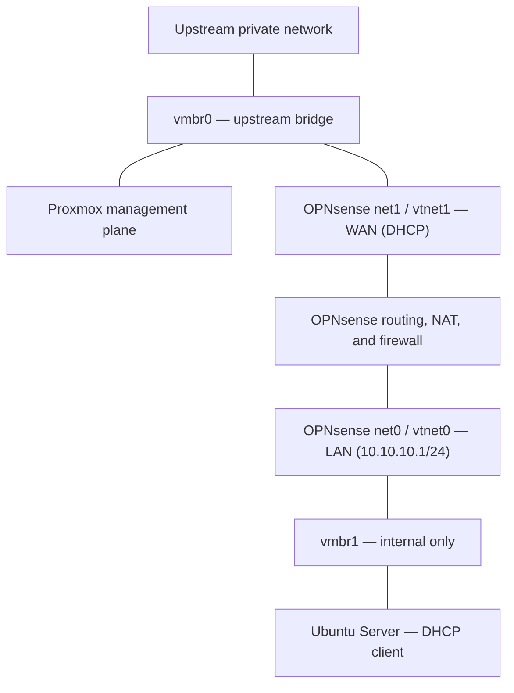

# Project 02: OPNsense Network Segmentation

> **Technical status:** Verified for IPv4  
> **Last updated:** 2026-09-07  
> **Platform:** Two-interface OPNsense VM on Proxmox VE  
> **Portfolio status:** Published

## 1. Objective

Create a controlled IPv4 path between the upstream private network and an internal-only cybersecurity lab network.

OPNsense provides routing, DHCP, DNS forwarding, NAT, firewall policy, and logging for lab endpoints attached to the isolated Proxmox bridge.

## 2. Scope

This project includes:

- Deploying OPNsense as a two-interface virtual machine
- Connecting the WAN side to Proxmox bridge `vmbr0`
- Connecting the LAN side to internal-only bridge `vmbr1`
- Configuring the lab subnet, DHCP, DNS forwarding, and outbound NAT
- Creating a logged IPv4 block for the protected upstream destination above the broader LAN allow rule
- Testing that rule with a controlled SSH connection from the Ubuntu lab endpoint
- Correlating the denied endpoint result with the OPNsense firewall log

This project does not claim comprehensive isolation of every protocol, management service, or IPv6 path. Those tests remain required before intentionally vulnerable systems are introduced.

## 3. Architecture

- `vmbr0` connects the physical network, Proxmox management plane, and OPNsense WAN.
- `vmbr1` has no physical uplink or Proxmox host address.
- OPNsense is the only intended Layer 3 path between `vmbr1` and upstream networks.
- A lab guest must not receive an additional adapter on `vmbr0`, because that would bypass the firewall path.

The complete current topology is documented in [`architecture.md`](../../docs/architecture.md).

## 4. Implemented Configuration

### OPNsense virtual machine

| Component | Configuration |
|---|---|
| VM ID | `100` |
| OPNsense release | 26.7 (amd64) |
| Processor | 2 virtual CPUs |
| Memory | 4096 MiB with ballooning disabled |
| Virtual disk | 32 GiB on `local-lvm` |
| Firmware and machine | OVMF/UEFI with Q35 |
| Disk controller | VirtIO SCSI |
| LAN adapter | Proxmox `net0` on `vmbr1`; OPNsense `vtnet0` |
| WAN adapter | Proxmox `net1` on `vmbr0`; OPNsense `vtnet1` |
| Startup | Start at boot, order 1, with a 30-second delay |

The adapter roles were verified from both sides of the virtualization boundary rather than inferred from interface numbering.

### IPv4 services

| Service | Implemented state |
|---|---|
| LAN gateway | `10.10.10.1/24` |
| DHCP | Dnsmasq DHCP with lab-only scope `10.10.10.100`–`10.10.10.200` |
| DNS | Forwarding available to LAN clients |
| NAT | Outbound IPv4 translation through the OPNsense WAN |
| WAN addressing | DHCP from the upstream private network; exact lease omitted |
| Web administration | LAN-side access only; not exposed on WAN |

Because the OPNsense WAN is behind a private home router, WAN **Block private networks** is disabled for this deployment. The default WAN deny behavior remains in place, and no home-router port forwarding exposes the firewall or lab systems to the internet.

## 5. Firewall Policy Tested

The configured rule uses:

| Field | Value |
|---|---|
| Interface | LAN |
| Address family | IPv4 |
| Protocol | Any IPv4 protocol |
| Source | LAN network |
| Source port | Any |
| Destination | Protected upstream destination |
| Destination port | Any |
| Action | Block and log |
| Order | Above the general IPv4 LAN allow rule |

The rule is broader than the single validation flow: it is configured to block IPv4 traffic to the protected destination, while the observed test used SSH on TCP destination port 22. That test confirms one representative flow matched the rule; it does not prove that every protocol and management path has been exercised.

This policy was tested only against an endpoint owned or explicitly authorized for the lab exercise.

## 6. Validation

| Test ID | Test | Expected result | Result |
|---|---|---|---|
| `VAL-01` | Request IPv4 configuration from Ubuntu on `vmbr1` | OPNsense supplies a lab address, gateway, and DNS | **Pass** |
| `VAL-02` | Resolve a public hostname and request an approved HTTPS resource | DNS and outbound traffic pass through OPNsense | **Pass** |
| `VAL-03` | Initiate the controlled upstream SSH connection | The protected-destination rule denies the tested TCP destination port 22 connection | **Pass** |
| `VAL-04` | Filter OPNsense logs for the test connection | A matching blocked connection is visible | **Pass** |
| `VAL-05` | Test multiple protocols against a protected upstream test host | Unauthorized traffic is denied and logged | **Not yet performed** |
| `VAL-06` | Test Proxmox and OPNsense management reachability from Ubuntu | Unauthorized management access is denied and logged | **Not yet performed** |
| `VAL-07` | Inspect and test IPv6 addressing and routes | No IPv6 path bypasses the boundary | **Not yet performed** |

The successful SSH test proves the tested IPv4 rule, protocol, direction, and destination port. It does not prove that every other upstream or management path is blocked.

## 7. Evidence

The draft evidence index, required captures, captions, and sanitization record are maintained in [`evidence/README.md`](evidence/README.md).

The publication set is designed around seven artifacts:

| Evidence ID | Required artifact | Collection status |
|---|---|---|
| `OPN-E01` | Proxmox OPNsense adapter assignments | **Reviewed** |
| `OPN-E02` | OPNsense WAN/LAN interface overview | **Reviewed** |
| `OPN-E03` | OPNsense DHCP lease for the Ubuntu endpoint | **Reviewed** |
| `OPN-E04` | Sanitized Ubuntu IPv4, DNS, and approved HTTPS output | **Reviewed** |
| `OPN-E05` | OPNsense LAN firewall rule order | **Reviewed** |
| `OPN-E06` | Timestamped denied SSH test from Ubuntu | **Reviewed** |
| `OPN-E07` | Matching OPNsense firewall block log | **Reviewed** |

All seven publication artifacts are present, sanitized, reviewed, and included with this project write-up.

## 8. Problems Encountered

### Initial LAN-side administration required a temporary path

**Observed issue:** The OPNsense web interface was initially reachable only from its LAN side, while the trusted workstation was upstream.

**Resolution:** Used a temporary Proxmox LAN-side address and SSH tunnel for bootstrap administration, then removed both after normal access was established.

**Lesson:** Temporary management paths should be narrowly scoped, documented, and removed after use.

### WAN DHCP addressing changed

**Observed issue:** The upstream router later issued a different private WAN address.

**Resolution:** Confirmed the current lease and documented the interface by role and bridge mapping rather than relying on one dynamic address.

**Lesson:** Interface identity and topology are more durable evidence than a DHCP lease value.

### The first firewall rule did not take effect in its original position

**Observed issue:** The broader LAN allow rule matched traffic before the protected-destination block.

**Resolution:** Moved the logged protected-destination block above the broader allow rule, applied the pending ruleset, generated a fresh SSH test, and located the matching firewall-log entries.

**Lesson:** A rule is not verified merely because it exists in the configuration view. Its changes must be applied, and rule order, traffic matching, endpoint behavior, and logs must agree.

## 9. Security Reasoning

- Lab endpoints use `vmbr1` and do not receive a direct adapter on `vmbr0`.
- OPNsense provides the routed control point for north-south lab traffic.
- Documentation limits the validated claim to the observed SSH flow even though the configured IPv4 rule is broader.
- Logged deny rules support correlation between endpoint behavior and firewall enforcement.
- No management or lab service is exposed through home-router port forwarding.
- Exact upstream addressing and hardware identifiers are excluded from public evidence.

Detailed controls and residual risk are documented in [`security-boundaries.md`](../../docs/security-boundaries.md).

## 10. Skills Demonstrated

- Proxmox virtual-network design
- Firewall VM deployment
- Virtual-to-guest interface mapping
- IPv4 subnetting and DHCP
- DNS forwarding and outbound NAT
- Stateful firewall rule design
- First-match rule-order analysis
- Controlled allow-and-deny testing
- Firewall-log correlation
- Evidence sanitization and scope-aware reporting

## 11. Limitations and Remaining Work

- The validated restriction covers one controlled IPv4 SSH path, not every protocol or destination.
- Comprehensive lab-to-protected-network blocking is not yet tested.
- Proxmox and OPNsense management-plane denial from `vmbr1` is not yet tested.
- IPv6 has not yet been validated or deliberately disabled across the path.
- OPNsense and Proxmox management/upstream traffic share `vmbr0` in the single-NIC design.
- OPNsense does not ordinarily inspect traffic exchanged directly between guests on the same `vmbr1` subnet.
- Formal external validation of unsolicited inbound denial has not been documented.
- Intentionally vulnerable systems should not be introduced until the protected-network, management-plane, and IPv6 controls are completed.

## 12. Outcome

The lab has an operational IPv4 network boundary in which OPNsense routes traffic between the upstream and internal-only Proxmox bridges. An Ubuntu endpoint received lab networking, used approved DNS and outbound HTTPS, and generated a controlled SSH connection that was denied by the intended rule and correlated with the OPNsense firewall log.

Comprehensive management-network and IPv6 isolation testing remains in progress.

## 13. Related Documentation

- [Evidence pack](evidence/README.md)
- [Lab architecture](../../docs/architecture.md)
- [Security boundaries](../../docs/security-boundaries.md)
- [Lessons learned](../../docs/lessons-learned.md)
- [Project roadmap](../../ROADMAP.md)

## 14. Change Log

| Date | Change |
|---|---|
| 2026-09-07 | Published the sanitized seven-artifact evidence pack and aligned the documented claims with the observed IPv4 SSH validation. |
| 2026-09-07 | Created the LAB-02 project draft and defined the minimum publication evidence set. |
