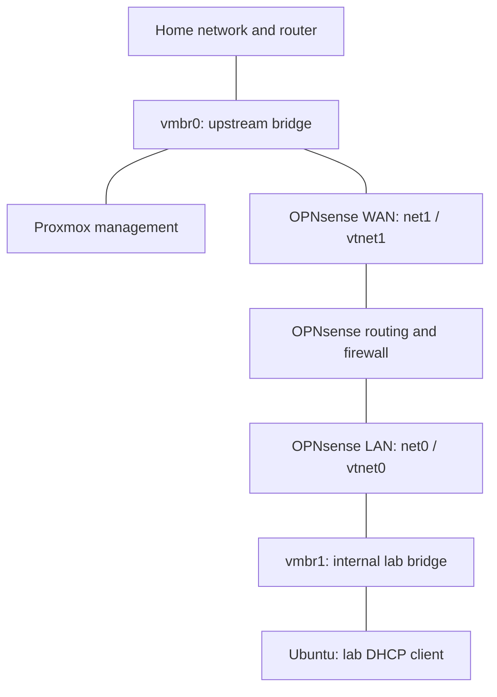

# Project 02: OPNsense Network Segmentation

> **Technical status:** Verified for the recorded IPv4 setup and SSH test\
> **Portfolio status:** Published\
> **Platform:** OPNsense VM on Proxmox VE\
> **Last updated:** 2026-09-25

## What I wanted to learn

After creating the virtual bridges in Proxmox, I needed to understand how a lab VM could reach the internet while keeping its connections under a firewall's control. This was my first time building that kind of network.

I used OPNsense as the lab's router and firewall. A router moves traffic between networks; a firewall decides which traffic is allowed. OPNsense also supplies the lab's DHCP and DNS services. Ubuntu was the endpoint I used to check the setup.

The result is a working IPv4 path and one recorded blocked SSH connection. Broader home-network, management-access, and IPv6 testing remains unfinished.

## How I connected it

WAN faces the existing home network through `vmbr0`. LAN faces the lab through `vmbr1`. The WAN address is private because OPNsense sits behind my home router.

The adapter numbering took some attention: Proxmox `net1` appears as OPNsense `vtnet1` and is WAN; `net0` appears as `vtnet0` and is LAN. I checked the mapping in both systems. The [hardware](evidence/01-proxmox-opnsense-nics.png) and [interface](evidence/02-opnsense-interface-overview.png) screenshots preserve that relationship.

`vmbr1` has no physical uplink. Its documented design has no permanent Proxmox IPv4 address, although I used a temporary host address for LAN-side administration. The [architecture notes](../../docs/architecture.md) explain that exception.

## The configuration I recorded

| Setting | Recorded value |
|---|---|
| VM and guest | Proxmox VM `100`, OPNsense 26.7 amd64 |
| CPU and RAM | 2 virtual cores, 4096 MiB RAM, ballooning disabled |
| Main disk | 32 GiB on `local-lvm` |
| Virtual hardware | OVMF UEFI, Q35, VirtIO SCSI |
| WAN | `net1` on `vmbr0`; guest `vtnet1`; upstream DHCP |
| LAN | `net0` on `vmbr1`; guest `vtnet0`; `10.10.10.1/24` |
| Lab DHCP | Dnsmasq scope recorded as `10.10.10.100`–`10.10.10.200` |
| Lab DNS and outbound IPv4 | DNS service for clients and outbound NAT through WAN |
| Administration | Proxmox console or deliberate LAN-side access |

The hardware and guest-interface screenshots support the VM resources and adapter mapping. The DHCP lease and Ubuntu output show the client using the lab network and reaching an HTTPS site. Some setup details, including the full DHCP scope, remain configuration notes rather than separately captured settings.

Earlier notes record start-at-boot order 1 with a 30-second delay. The published hardware view does not show those options, and I have not documented a full host-restart test.

Because WAN connects to a private home network, the setup notes record disabling WAN's **Block private networks** option. This is separate from allowing arbitrary incoming connections. The documented setup retains WAN deny behavior and uses no home-router port forwarding, but independent external testing is still pending.

## The firewall rule I tested

| Field | Configured value |
|---|---|
| Interface and address family | LAN, IPv4 |
| Source | LAN network |
| Protocol and ports | Any |
| Destination | Selected protected upstream destination |
| Action | Block and log |
| Position | Above the broad IPv4 LAN allow rule |

I used an SSH attempt from Ubuntu to the authorized protected test endpoint. SSH uses TCP destination port 22. The rule's configured scope covers more traffic than that single test, so I keep the configuration and tested result separate.

For the quick interface rules used here, an earlier matching rule takes effect. Placing the specific block above the broad allow rule gives the block a chance to match the new connection. Other OPNsense rule categories and connection states also matter; the [official documentation](https://docs.opnsense.org/manual/firewall.html#processing-order) explains that processing model.

The broad IPv4 allow rule remains in the saved configuration. The lab is not enforcing a narrow website or update-repository allowlist. The screenshot also contains a separate IPv6 allow rule, which is one reason IPv6 review remains open.

## How I checked the result

| Check | Recorded result |
|---|---|
| `VAL-01`: Ubuntu gets lab networking | DHCP lease and guest output show an address on the lab subnet, with gateway and DNS at `10.10.10.1` |
| `VAL-02`: Hostname-based HTTPS request works | Ubuntu recorded HTTP status `200` from `example.com`, supporting the tested DNS and outbound connection |
| `VAL-03`: Protected-destination SSH attempt is denied | Ubuntu recorded a timeout on TCP/22 |
| `VAL-04`: Firewall records the test | OPNsense logged matching LAN TCP/22 blocks under the intended rule label |
| `VAL-05`: Additional protocols and destinations | Not yet performed |
| `VAL-06`: Unauthorized Proxmox/OPNsense management access | Not yet comprehensively tested |
| `VAL-07`: IPv6 boundary | Not yet tested |

The SSH attempt was recorded at `2026-09-07T02:55:56Z`; the associated block sequence began at `02:55:57`. The connection fields and close timestamps tie the timeout to the firewall action. A timeout alone would not have established the cause.

All seven published artifacts and their explanations are in the [evidence index](evidence/README.md): adapter mapping, guest interfaces, DHCP lease, allowed egress, rule order, SSH timeout, and the firewall log.

## Problems I worked through

### Reaching the LAN web interface from my workstation

My workstation was on the home network, while the OPNsense web interface was on the lab side. I used an SSH tunnel through Proxmox and a temporary `10.10.10.2/24` address on `vmbr1`.

The LAB-02 record includes closing the tunnel and removing that address after use. Later Ubuntu work used the path again, so I should confirm cleanup after each session. A previous cleanup does not establish the current runtime state.

### Tracking a changed WAN address

The home router issued a different DHCP lease to OPNsense. Checking the console helped me separate a changed address from a changed interface role. I now describe WAN by its bridge and adapter mapping and check its current lease when needed.

### Getting useful firewall evidence

Live View initially showed no entries for the Ubuntu source filter. I checked the source address, logging, rule order, and whether changes had been applied, then generated a fresh SSH attempt. Matching blocks appeared.

This taught me to check several possible causes before deciding what failed. The successful retest establishes the resulting behavior; it does not isolate one earlier setting as the sole cause of the empty log.

## What I learned about the boundary

I can now follow a connection from Ubuntu, through `vmbr1`, into OPNsense LAN, and toward WAN on `vmbr0`. I also learned that two guests on the same lab subnet normally communicate directly through `vmbr1`. Their traffic does not need to pass through OPNsense, so Ubuntu's host firewall has a separate job.

The skills I practiced were VM deployment, adapter mapping, IPv4 addressing, DHCP/DNS, NAT, rule ordering, controlled connection tests, and matching a client result to a firewall log. I am still building confidence with these concepts, which is why I keep the test scope visible.

## What remains

I still need to verify the full protected-network policy, test unauthorized access to Proxmox and OPNsense management services, and resolve IPv6 behavior. Management and upstream traffic also share the same physical interface, and both the firewall and its guests depend on one host.

The required checks before deliberately vulnerable targets are recorded in the [security boundaries](../../docs/security-boundaries.md). The broader [lessons learned](../../docs/lessons-learned.md) explain the troubleshooting in more detail. My next ongoing project is the [Ubuntu baseline](../03-ubuntu-server-baseline/), with future work in the [roadmap](../../ROADMAP.md).

## Change log

| Date | Change |
|---|---|
| 2026-09-25 | Rewrote the project as a learning narrative; clarified configuration versus test evidence, temporary access, and the limits of the current policy. |
| 2026-09-07 | Created the write-up and published the seven-artifact evidence pack for the recorded IPv4 setup and SSH test. |
