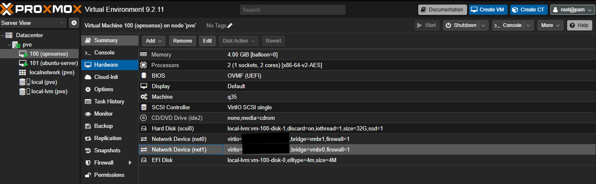
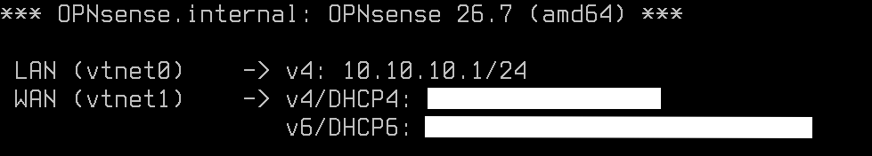
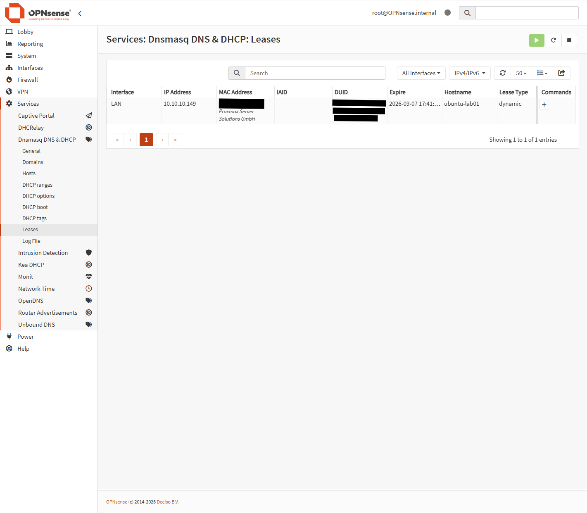
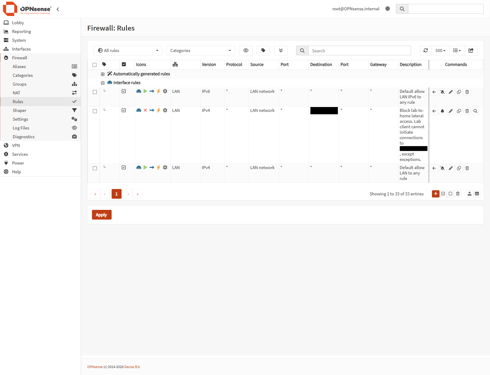
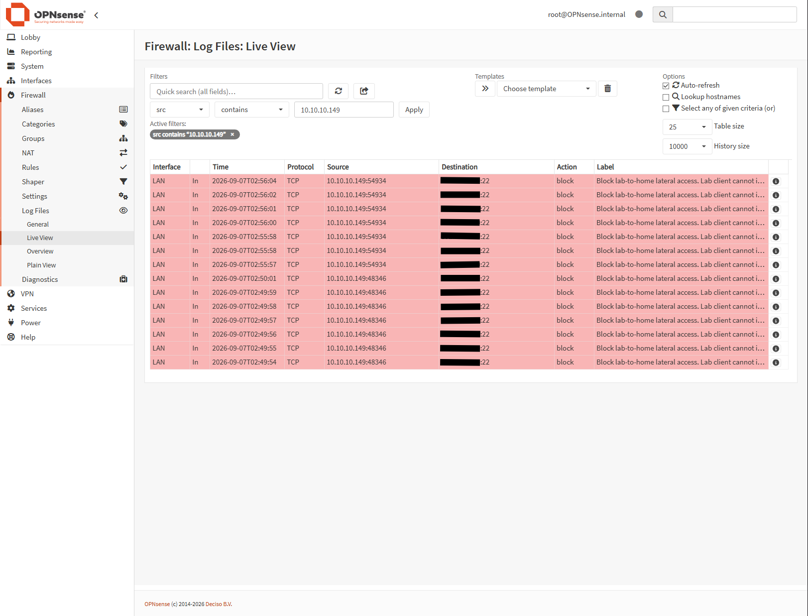

# LAB-02 Evidence Pack

> **Technical status:** Verified for IPv4  
> **Portfolio status:** Published  
> **Platform captured:** OPNsense 26.7 (amd64)  
> **Evidence captured:** 2026-09-07  
> **Last reviewed:** 2026-09-07

## 1. Purpose

This evidence pack supports the claims in the [OPNsense Network Segmentation project write-up](../README.md) with selected, sanitized artifacts.

The publication standard is deliberately narrow: the pack proves the implemented IPv4 topology, approved client networking, and one logged SSH test of the protected-destination block rule. It does not present that test as proof of comprehensive protected-network, management-plane, or IPv6 isolation.

## 2. Evidence Required for Publication

| Evidence ID | Planned filename | Review status | What the artifact must visibly demonstrate |
|---|---|---|---|
| `OPN-E01` | [`01-proxmox-opnsense-nics.png`](01-proxmox-opnsense-nics.png) | **Reviewed** | Proxmox `net0` is attached to `vmbr1`, and `net1` is attached to `vmbr0` |
| `OPN-E02` | [`02-opnsense-interface-overview.png`](02-opnsense-interface-overview.png) | **Reviewed** | OPNsense maps `vtnet0` to LAN and `vtnet1` to WAN; LAN is `10.10.10.1/24` and WAN uses DHCP4 |
| `OPN-E03` | [`03-opnsense-dhcp-lease.png`](03-opnsense-dhcp-lease.png) | **Reviewed** | The Ubuntu endpoint has a current dynamic lease from the OPNsense LAN DHCP service |
| `OPN-E04` | [`04-ubuntu-ipv4-egress.txt`](04-ubuntu-ipv4-egress.txt) | **Reviewed** | Ubuntu has a lab IPv4 address, uses `10.10.10.1` as its default route/DNS service, resolves a hostname, and receives an approved HTTPS response |
| `OPN-E05` | [`05-opnsense-lan-rules.png`](05-opnsense-lan-rules.png) | **Reviewed** | The IPv4 protected-destination block is above the broader IPv4 LAN allow rule |
| `OPN-E06` | [`06-ubuntu-ssh-denied.txt`](06-ubuntu-ssh-denied.txt) | **Reviewed** | A timestamped connection attempt to the controlled SSH test endpoint times out |
| `OPN-E07` | [`07-opnsense-firewall-block.png`](07-opnsense-firewall-block.png) | **Reviewed** | Firewall-log entries at the matching time block the tested LAN IPv4 TCP/22 connection |

All seven files are publication gates. An item remains **Needed** until the exact archive file is present, legible, sanitized, and reviewed against its caption.

## 3. Evidence Review Record

All seven required artifacts are now available as reviewed publication copies. This table records their disposition.

| Evidence | Prior record | Current action |
|---|---|---|
| Proxmox VM 100 NIC mapping | Current sanitized archive copy reviewed on 2026-09-07 | Complete as `OPN-E01` |
| OPNsense interface identity | Current sanitized archive copy reviewed on 2026-09-07 | Complete as `OPN-E02` |
| Ubuntu address, gateway, DNS, and egress | Current sanitized text artifact reviewed on 2026-09-07 | Complete as `OPN-E04` |
| Firewall rule order | Current sanitized archive copy reviewed on 2026-09-07 | Complete as `OPN-E05` |
| Denied SSH result | Current sanitized text artifact reviewed on 2026-09-07 | Complete as `OPN-E06` |
| Matching OPNsense block log | Current sanitized archive copy reviewed on 2026-09-07 | Complete as `OPN-E07` |
| DHCP lease | Current sanitized archive copy reviewed on 2026-09-07 | Complete as `OPN-E03` |

The earlier WAN WebGUI negative test and temporary bootstrap-tunnel cleanup are useful troubleshooting records, but neither is required for the minimum publication set. A browser failure alone is ambiguous, and absence of a temporary path is better documented as a procedure unless a clean configuration-state artifact is available.

## 4. Reviewed Artifacts and Captions

### `OPN-E01` — Proxmox adapter assignments



> **Proxmox hardware view showing OPNsense `net0` attached to internal bridge `vmbr1` and `net1` attached to upstream bridge `vmbr0`. Virtual MAC addresses are redacted.**

Related controls and validation: `SB-03`, `ARC-VAL-04`.

### `OPN-E02` — OPNsense interface roles



> **OPNsense console summary mapping `vtnet0` to LAN at `10.10.10.1/24` and `vtnet1` to the DHCP4-configured WAN. WAN addressing is redacted.**

The console also reports DHCPv6 state on WAN. That observation is not treated as proof of IPv6 isolation; `VAL-07` remains **Not yet performed**.

Related controls and validation: `SB-03`, `ARC-VAL-04`.

### `OPN-E03` — LAN DHCP lease



> **OPNsense Dnsmasq lease table showing a current dynamic LAN lease of `10.10.10.149` for the Ubuntu lab endpoint. The client MAC address and DUID are redacted.**

Related controls and validation: `SB-04`, `VAL-01`, `ARC-VAL-05`.

### `OPN-E04` — Allowed IPv4 services and egress

The complete sanitized output is available in [`04-ubuntu-ipv4-egress.txt`](04-ubuntu-ipv4-egress.txt).

> **Sanitized Ubuntu output showing a DHCP-derived lab IPv4 address on `ens18`, a default route and DNS service through `10.10.10.1`, and an approved HTTPS response from `example.com`.**

Because the successful HTTPS request used a hostname, the `200` response also provides functional evidence of DNS resolution without publishing a resolved external IP address.

Related controls and validation: `SB-02`, `SB-04`, `VAL-01`, `VAL-02`, `ARC-VAL-05`.

### `OPN-E05` — Ordered LAN policy



> **OPNsense LAN rules showing the IPv4 block from `LAN network` to the protected upstream destination above the general IPv4 LAN allow rule. The protected destination is redacted.**

The configured block applies to any IPv4 protocol and port for the protected destination. The evidence pack validates only the controlled SSH/TCP 22 flow against this rule. A separate default IPv6 allow rule is also visible; IPv6 boundary testing remains explicitly incomplete under `VAL-07`.

This configuration view establishes the displayed rule scope and order; it is not treated as standalone proof of active enforcement. `OPN-E06` and `OPN-E07` provide that functional proof through the timestamped endpoint result and matching firewall blocks collected after the ruleset was applied.

Related controls and validation: `SB-05`, `VAL-03`, `ARC-VAL-06`.

### `OPN-E06` — Denied SSH test

The complete sanitized output is available in [`06-ubuntu-ssh-denied.txt`](06-ubuntu-ssh-denied.txt).

> **Timestamped Ubuntu SSH attempt to the redacted protected target on TCP destination port 22 ending in a connection timeout.**

The attempt began at `2026-09-07T02:55:56Z`. `OPN-E07` records matching OPNsense blocks beginning at `02:55:57`, correlating the endpoint result with firewall enforcement without exposing the protected target address.

Related controls and validation: `SB-05`, `VAL-03`, `ARC-VAL-06`.

### `OPN-E07` — Correlated firewall log



> **Filtered OPNsense Live View showing repeated LAN TCP blocks from `10.10.10.149` to the redacted protected target on destination port 22, under the intended protected-network rule.**

The top sequence at `02:55:57`–`02:56:04` corresponds to the final recapture. Repeated rows reflect TCP retransmission attempts during the connection timeout. The source filter, LAN interface, TCP protocol, destination port, block action, and rule label remain visible; the protected destination address is redacted.

Related controls and validation: `SB-05`, `VAL-04`, `ARC-VAL-06`.

## 5. Optional Supporting Evidence

The following can strengthen the pack but does not block publication:

| Evidence ID | Suggested filename | Purpose |
|---|---|---|
| `OPN-S01` | `08-qm-config-100.txt` | Runtime/configuration corroboration for VM resources, adapter bridges, and startup behavior |
| `OPN-S02` | `09-opnsense-system-information.png` | Records the OPNsense version and system state at collection time |

For `OPN-S01`, run this on the Proxmox host and review the output before saving it:

```bash
qm config 100 \
  | grep -E '^(name|bios|machine|cores|memory|balloon|scsihw|net0|net1|onboot|startup):' \
  | sed -E 's/(virtio=)[^,]+/\1[REDACTED]/'
```

> **Draft optional caption:** Sanitized Proxmox configuration output confirming the OPNsense VM resource profile, bridge assignments, and startup settings. Virtual MAC addresses are replaced with `[REDACTED]`.

Optional runtime corroboration is intentionally listed in this README so its purpose and non-gating status remain clear.

## 6. Sanitization Record

Remove or obscure:

- OPNsense WAN address, upstream gateway, and exact upstream subnet details
- Address or hostname of the controlled protected test endpoint
- Public IP lookup results
- MAC addresses and DHCP client identifiers
- Personal usernames, hostnames, browser profiles, and unrelated household-device names
- Tokens, passwords, private keys, recovery data, and session identifiers
- Serial numbers, UUIDs, raw configuration exports, and unrelated log entries

Intentionally retain because it supports the documented claims:

- Bridge names `vmbr0` and `vmbr1`
- Adapter names `net0`, `net1`, `vtnet0`, and `vtnet1`
- LAN network `10.10.10.0/24` and gateway `10.10.10.1`
- VM IDs `100` and `101` and generic role-based guest names
- Configured rule action, direction, address family, protocol/port scope, logging state, and order
- TCP destination port 22 for the controlled validation flow
- Evidence timestamps needed to correlate the endpoint test and firewall log
- Product versions when they do not expose an unrelated identifier
- Non-unique virtualization-vendor labels shown beside a redacted hardware address

Redaction should cover the value completely without obscuring the nearby field label needed to understand the evidence.

## 7. Scope Boundary

This pack may support these claims:

- OPNsense is connected between `vmbr0` and `vmbr1` using the documented adapter mapping.
- The Ubuntu endpoint received IPv4 configuration and used approved DNS and HTTPS through OPNsense.
- A logged IPv4 protected-destination block was ordered above the broader IPv4 LAN allow rule.
- The controlled SSH attempt was denied and correlated with an OPNsense firewall-log entry.

This pack must not claim that:

- Every protocol or port from the lab to the protected upstream network is blocked.
- Proxmox or OPNsense management access from the lab has been comprehensively denied and tested.
- IPv6 cannot bypass the current IPv4 policy.
- Same-subnet traffic on `vmbr1` passes through OPNsense.
- A browser failure by itself proves a firewall control.
- Unsolicited inbound denial has been independently tested from the public internet.

## 8. Publication Verification

- [x] All seven required artifacts are present under their planned filenames.
- [x] Each screenshot is legible at normal repository viewing size.
- [x] `OPN-E01` and `OPN-E02` agree on the `net0`/`vtnet0` LAN and `net1`/`vtnet1` WAN mapping.
- [x] `OPN-E03` and `OPN-E04` agree on the lab network and endpoint role.
- [x] `OPN-E05` shows the protected-destination rule, while `OPN-E06` and `OPN-E07` document the same controlled TCP/22 flow matching it.
- [x] Endpoint and firewall timestamps are close enough to support correlation.
- [x] Captions state only what each artifact visibly demonstrates.
- [x] Upstream addresses, MAC addresses, unique identifiers, and unrelated data are obscured.
- [x] The project remains **Verified for IPv4** and does not imply completion of `VAL-05`, `VAL-06`, or `VAL-07`.
- [x] `security-boundaries.md` describes the broader protected-destination rule while limiting functional validation to the observed SSH flow.
- [x] Project README, evidence README, root README, and roadmap statuses are updated together when the pack is published.

The publication checklist is complete. This pack is published with the LAB-02 project write-up while the explicitly listed management-plane and IPv6 validation work remains open.
